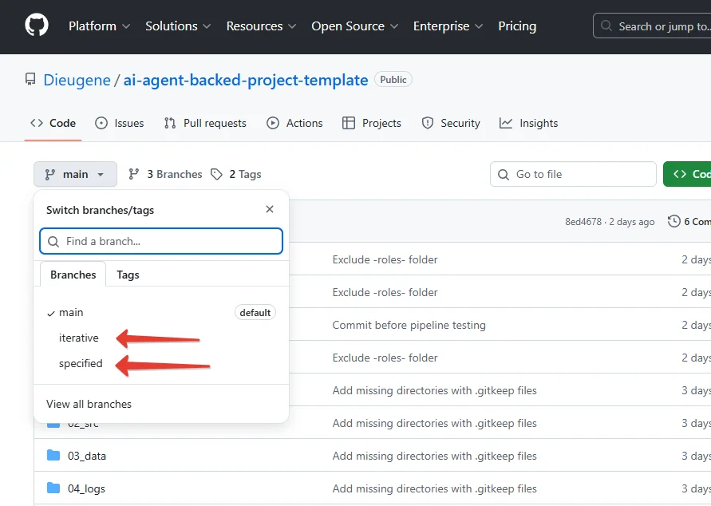

# AI Agent-Backed Project Template

## 🚀 Workspace для разработки — как стартовать

Скопируйте `launch-project.md` из корня репозитория в:
- **Windows:** `C:\Users\<user>\.claude\commands\`
- **macOS/Linux:** `~/.claude/commands/`

Запустите в Claude Code или Cursor:
```
/launch-project
```

Вся магия там. На русском. Заглядывайте, если интересно.

---

## 📖 А почитать?

**Работаете итеративно по задачам?**  
→ [Iterative Branch](https://github.com/Dieugene/ai-agent-backed-project-template/tree/iterative)  
Для исследовательских проектов. Разбираетесь в теме, делаете задачу, смотрите результат, переходите к следующей.

**Есть видение всего проекта?**  
→ [Specified Branch](https://github.com/Dieugene/ai-agent-backed-project-template/tree/specified)  
Обсуждаете всё с Architect, дальше Tech Lead управляет реализацией. Делегируете и контролируете.

**Хотите просто посмотреть?**  
Переключайтесь между ветками через GitHub:



---

**Версии:** Репозиторий использует теги `iterative-v1.X` и `specified-v1.X`. Команда `/launch-project` берет последнюю автоматически.
