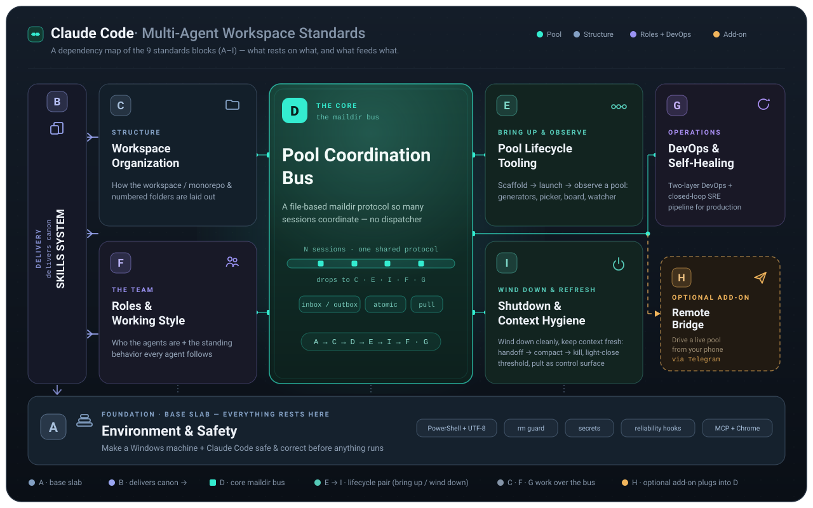

# Agent-Backed Workspace — Knowledge Base & Reference Implementation



A field-tested knowledge base for running a Windows workspace where **multiple Claude Code sessions ("agents") work in parallel under one human owner** — coordinating with each other through a file-based bus, with **no human dispatcher in the loop**. It is both a KB (the `docs/`) and an **anonymized, working reference implementation** (the `scripts/`, `commands/`, and `remote-bridge/`) you can lift onto a fresh machine.

This is for anyone who has outgrown a single Claude Code session and wants a durable pattern for a *team* of specialized peer-agents — a Tech Lead, a QA peer, DevOps — that pass work between themselves, survive `/compact` and restarts, and stay observable. Everything here comes from real practice; every identifier is a placeholder, so nothing leaks and everything is reusable.

> **This repo (`main`) is the multi-peer workspace knowledge base + reference implementation** — the standards a team of parallel Claude Code agents runs on.

---

## How it fits together

The pieces stack in a dependency spine — read top to bottom and each layer rests on the one above it:

> **Foundation (A)** underpins everything → **Workspace Organization (C)** is the container → the **Pool Coordination Bus (D)** is the core coordination protocol → **Pool Lifecycle Tooling (E)** scaffolds, launches, and observes it → **Roles (F)** and **DevOps (G)** do their work *over* the bus → the **Skills System (B)** delivers all this knowledge to agents without bloating context → the **Remote Bridge (H)** is an optional remote onto the bus from your phone.

---

## What's inside

The knowledge base is organized into **9 standards blocks (A–I)**. Each links to its key docs.

### A — Foundation: Environment & Safety
The bedrock every session sits on: Windows/PowerShell gotchas, secret hygiene, global reliability guards (a hard block on catastrophic `rm`, a process-kill advisory, a malformed-output detector), and Claude Code environment setup.
→ [Windows / PowerShell Pitfalls](docs/windows-powershell-pitfalls.md) · [Handling Secrets](docs/handling-secrets.md) · [Safety Guards](docs/safety-guards.md) · [Claude Code Setup](docs/claude-code-setup.md)

### B — Skills System
How knowledge reaches agents *without* bloating their context: thin skill stubs plus a canon-injector (`ref.ps1`), the listing budget, and the discovery cascade.
→ [The Skills System](docs/the-skills-system.md)

### C — Workspace Organization
The container for everything: monorepo variants A/B, plain vs. pool mode, workspace and subproject anatomy, and bootstrap.
→ [Workspace Organization](docs/workspace-organization.md)

### D — Pool Coordination Bus  *(the core)*
The heart of the system: a **file-based maildir bus** over which N sessions coordinate with **no human dispatcher**. A message is an immutable file; an address is a folder. The delivery invariant is held by the *tool*, not by agent discipline.
→ [Pool Communication](docs/pool-communication.md) · [Wrapper & Hook Scripts](docs/wrapper-and-hook-scripts.md) · [Pool Standard Tiers](docs/pool-standard-tiers.md) · [Lessons Learned](docs/lessons-learned.md)

### E — Pool Lifecycle Tooling
Scaffold → launch → observe. One command stands up a bus-native pool; an fzf picker launches it into Warp; a live board and watcher keep it visible.
→ [Pool Scaffolding](docs/pool-scaffolding.md) · [Pool Launcher & Warp](docs/pool-launcher-and-warp.md) · [Board & Watcher](docs/board-and-watcher.md) · [Intra-Project Pool Recipe](docs/intra-project-pool-recipe.md)

### F — Roles & Working Style
The one active agent model (subagent-driven Tech Lead), the QA peer, and the standing working principles that keep agents autonomous and right-sized.
→ [Tech Lead Mode](docs/tech-lead-mode.md) · [QA Role](docs/qa-role.md) · [Working Principles](docs/working-principles.md) · [Right-Sizing & Artifacts](docs/right-sizing-and-artifacts.md)

### G — DevOps & Self-Healing
A two-layer DevOps model (server-wide orchestrator + per-monorepo DevOps) and a closed-loop self-healing pipeline for production services.
→ [DevOps Two-Layer Model](docs/devops-two-layer.md) · [Self-Healing Pipeline](docs/sre-self-healing-pipeline.md)

### H — Remote Bridge  *(optional add-on)*
Drive a live session or pool **from your phone via Telegram** — text or voice, behind NAT, no open ports. One engine copy per workspace; instances are wired by config. The only outbound channel is allowlisted; only the owner can write.
→ [remote-bridge/](remote-bridge/)

### I — Shutdown & Context Hygiene
The other half of the lifecycle after *launch & observe* (E): winding a pool down cleanly and keeping context fresh. An external controller runs **handoff → compact → kill** (a *light close* skips both for a near-empty session), reads a per-session context metric, and the picker doubles as the **pult** — one control surface to launch, shut down, or open the board. The direction of travel: agents that self-clean instead of a human babysitting `/compact`.
→ [Pool Shutdown & Context Refresh](docs/pool-shutdown-and-context-refresh.md)

### Top-level directories

| Directory | What it holds |
|-----------|---------------|
| [`docs/`](docs/) | The knowledge base — the 9 blocks above. Start at [`docs/README.md`](docs/README.md). |
| [`scripts/`](scripts/) | Anonymized reference PowerShell: the bus core `pool.ps1`, scaffolders `new-pool.ps1` / `add-peer.ps1` / `fresh-session.ps1`, launcher/pult `launch-pool.ps1`, shutdown controller `pool-shutdown.ps1`, guards `block-dangerous-rm.ps1` / `warn-process-kill.ps1` / `stop-detect-malformed.ps1`, canon-injector `ref.ps1`, board/notifier, and templates. |
| [`commands/`](commands/) | Reusable Claude Code slash-commands (prompt templates for `~/.claude/commands/`), e.g. [`handoff-myself`](commands/handoff-myself.md). |
| [`remote-bridge/`](remote-bridge/) | The Telegram "pult" — a working long-polling bridge engine plus a "connect your own bot" guide. Secrets live outside the repo. |

---

## Prerequisites

Install these on a clean Windows machine before standing up the workspace:

| Tool | Why |
|------|-----|
| **Node.js** (LTS) | Runtime for Claude Code. Also add `node.exe` to your antivirus trust list — see [Windows Pitfalls](docs/windows-powershell-pitfalls.md). |
| **Claude Code CLI** | The agent runtime; install and authenticate. |
| **Git for Windows** | Provides the `bash` the status line depends on. |
| **Warp** (terminal) | Pools launch via a generated Warp tab-config; without it, roles start from wrapper `.bat` files directly. |
| **fzf** (`fzf.exe`) | Powers the terminal pool picker. |
| **jq** | Used by the status-line hook. |

---

## Reading paths

Three short guided routes. The full index — with a one-line description of every document — lives in **[`docs/README.md`](docs/README.md)**.

**(a) Just browsing** — understand the model:
1. [Workspace Organization](docs/workspace-organization.md) — the overall shape.
2. [The Skills System](docs/the-skills-system.md) — how knowledge reaches agents.
3. [Pool Communication](docs/pool-communication.md) — how several agents coordinate.
4. [Tech Lead Mode](docs/tech-lead-mode.md) — how one agent works.

**(b) Bootstrapping a new machine** — stand it up from zero:
1. [Claude Code Setup](docs/claude-code-setup.md) — environment, memory, sessions.
2. [Safety Guards](docs/safety-guards.md) + [Windows Pitfalls](docs/windows-powershell-pitfalls.md) — guards and Windows gotchas.
3. [Workspace Organization](docs/workspace-organization.md) — bootstrap the workspace itself.
4. [Wrapper & Hook Scripts](docs/wrapper-and-hook-scripts.md) + [`scripts/`](scripts/) — assemble the pool infra.
5. [Pool Scaffolding](docs/pool-scaffolding.md), then [Pool Launcher & Warp](docs/pool-launcher-and-warp.md) + [Board & Watcher](docs/board-and-watcher.md) — launch and observe.

**(c) Debugging a prod incident** — find the loop and the layer:
1. [Self-Healing Pipeline](docs/sre-self-healing-pipeline.md) — the closed loop.
2. [DevOps Two-Layer Model](docs/devops-two-layer.md) — which layer does the fix.
3. The specific per-monorepo runbook (lives with the project, not in this KB).

---

## Project structure convention

Every workspace and subproject follows the same numbered layout. This is the short version — see [Workspace Organization](docs/workspace-organization.md) for the full anatomy, both monorepo variants, and bootstrap steps.

**Numbered top-level folders** (subproject):

```
00_docs/            # architecture/ | standards/ | specs/ | backlog.md
01_tasks/           # task folders NNN_short_name/   (workspace root uses 01_projects/)
02_src/             # source code
03_data/            # gitignored
04_logs/            # gitignored
```

**Dot-folders:** `.agents/` (agent setup), `.claude/` (Claude Code settings & hooks), `.worktrees/` (git worktrees). In pool mode, the bus lives in `.bus/` (maildir, gitignored, lazily created).

**Naming rules:**

| Thing | Convention |
|-------|-----------|
| Task folders | `NNN_short_name` (three-digit prefix) |
| File iterations | suffix `_NN` — `task_brief_01.md`, then `_02` on rework; **never overwrite** |
| ADRs | `decision_NNN_*.md` |
| Handoff / scratch files | prefixed with `_` — `_handoff_*.md`, `_questions_to_user.md` |

**The three doc files (all auto-loaded by Claude Code, different jobs):**

- **`AGENTS.md`** — describes the workspace for a developer and for an agent in plain mode: what it is, which subprojects, how they relate. Grows slowly.
- **`README.md`** — human-facing overview of the project.
- **`CLAUDE.md`** — the operational routing entry point: "where to go and what to read before answering." Required in pool mode; optional (or a thin pointer to `AGENTS.md`) in plain mode.

---

## Anonymization

Everything here is a reference, not a run-out-of-the-box package. **All identifiers are placeholders** — `<workspace-root>`, `<user-home>`, `<pool-name>`, `<role>-<scope>`, `<vps-ip>`. No real hosts, paths, subproject names, or secrets. Before using the scripts, do a global find/replace of `<workspace-root>` with your actual path (see [`scripts/README.md`](scripts/README.md)). Examples drawn from live practice are labeled as such.
