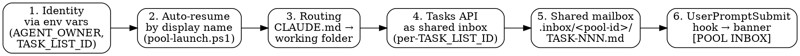
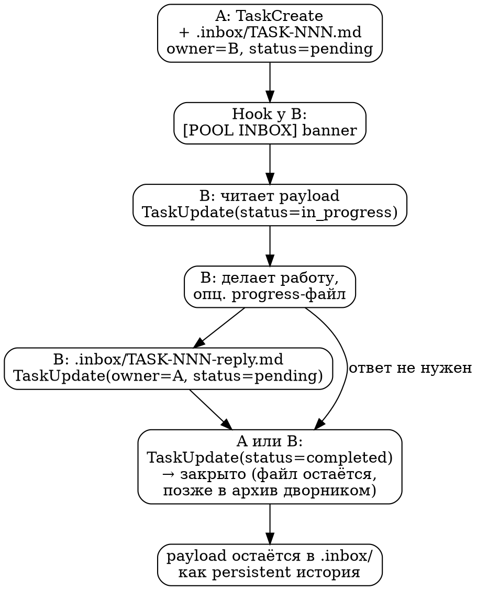

# Agent Pool Communication

Координационный слой, который позволяет нескольким сессиям Claude Code,
работающим в одной workspace-папке, обмениваться задачами без участия
человека-диспетчера. Это **базовый паттерн**, который применяется поверх
[Workspace Organization](workspace-organization.md) как опциональная
надстройка.

> Это описание паттерна, не инструкция под конкретный проект. Все
> идентификаторы (имена pool'ов, ролей, пути) заменены плейсхолдерами
> вида `<workspace-root>`, `<pool-name>`, `<role>-<scope>`. Примеры из
> практики обезличены.

---

## 1. Когда pool нужен, когда — нет

**Pool нужен**, когда любое из:

- 3+ активных Claude Code сессий, и пользователь устаёт быть диспетчером.
- Подпроекты делят интерфейс (API, формат данных), и его эволюция требует
  двусторонней синхронизации между сессиями.
- Один подпроект разрабатывается несколькими специализированными ролями
  параллельно (frontend / backend / qa / architect), и им нужно
  обмениваться задачами.
- Хочется автономной работы нескольких сессий в фоне или ночью.

**Pool избыточен**, когда:

- Один подпроект, один Tech Lead, никаких параллельных ролей.
- 1-2 подпроекта, пользователь сам в роли диспетчера справляется без
  перегрузки.
- Workspace стартовый и ещё не видно, какие подпроекты появятся.

Default для нового workspace — **plain** (без pool). Pool добавляется
бутстрапом, когда сигналы появились.

---

## 2. Шесть опор pool



1. **Идентичность** через env vars `AGENT_OWNER` и `CLAUDE_CODE_TASK_LIST_ID`,
   выставляемые wrapper-батником на старте сессии.
2. **Auto-resume по display name** — двойной клик по wrapper'у возвращает
   агента в его же conversation, не открывает свежую.
3. **Routing**: `<workspace-root>/CLAUDE.md` (auto-loaded Claude Code'ом)
   маппит `AGENT_OWNER` → путь к рабочей папке.
4. **Tasks API** для координации — общий per-task store
   `~/.claude/tasks/<TASK_LIST_ID>/<id>.json`, разделяемый между сессиями
   через одинаковый `CLAUDE_CODE_TASK_LIST_ID`.
5. **Общий mailbox** `<workspace-root>/.inbox/<pool-id>/TASK-NNN.md` —
   payload-файлы координации. Payload не двигается при смене owner.
6. **Hook UserPromptSubmit** инжектит баннер `[POOL INBOX] <owner>: N
   pending` перед каждым промптом пользователя.

Без env vars (опора 1) и hook'а (опора 6) — pool вырождается в обычные
независимые сессии. Без routing CLAUDE.md (опора 3) — агенты не находят
свою рабочую папку. Без mailbox (опора 5) — координация деградирует до
коротких записей в Tasks API, которые по `completed` теряют смысл сигнала (и копятся в сторе — см. ниже про дворник).

---

## 3. Идентичность агента

### Owner ID

Формат: `<role>-<scope>` в kebab-case ASCII. Примеры (обезличенные):

- `tech-lead-foo` — Tech Lead подпроекта foo в **inter-project pool**.
- `frontend-bar`, `backend-bar`, `qa-bar` — три peer'а одного подпроекта
  bar в **intra-project pool** (см. §6).

Owner ID:

- стабильный (не меняется между сессиями),
- уникальный в рамках pool,
- читаемый человеком,
- используется одновременно как `owner` в Tasks API и в баннере hook'а.

### Display name

Заголовок сессии, под которым она видна в `/resume`-пикере и которым её
ищет auto-resume helper. PascalCase: `TechLead-Foo`, `Frontend-Bar`.

Выставляется флагом `claude --name <title>` при первом запуске или вручную
через `/rename` внутри сессии.

### Передача в сессию

```
cmd.exe   (set AGENT_OWNER=...; set CLAUDE_CODE_TASK_LIST_ID=...)
   ↓ child process
powershell -NoProfile -File pool-launch.ps1
   ↓ child process
claude.exe --resume <id>   (или --name <title>)
   ↓ child process (Claude Code spawns hook on UserPromptSubmit)
hook inject-inbox.ps1
```

Все звенья наследуют env vars автоматически. Закрыл окно — переменные
умирают, никаких глобальных эффектов.

Подробности wrapper'ов и hook'а — [Wrapper and Hook Scripts](wrapper-and-hook-scripts.md).

---

## 4. Tasks API: формат и инвариант top-level `owner`

### Формат хранения

В актуальном Claude Code Tasks API хранит **каждую задачу отдельным
JSON-файлом**:

```
~/.claude/tasks/<TASK_LIST_ID>/
├── 1.json              # одна задача = один файл
├── 2.json
├── 7.json
├── .highwatermark      # счётчик последнего выданного ID
└── .lock               # файл-замок для concurrency
```

Никакого агрегатного `tasks.json` не существует (более старая публичная
документация местами ошибочно описывает агрегатный формат — это уже не
актуально).

**Структура одного task-файла:**

```json
{
  "id": "7",
  "subject": "TASK-007: <короткое название>",
  "description": "См. payload: .inbox/<pool-id>/TASK-007.md",
  "activeForm": "<глагол в активной форме у получателя>",
  "owner": "tech-lead-bar",
  "status": "pending",
  "blocks": [],
  "blockedBy": [],
  "metadata": {
    "display_id": "TASK-007",
    "from": "tech-lead-foo",
    "to": "tech-lead-bar",
    "kind": "coord",
    "payload_path": ".inbox/<pool-id>/TASK-007.md"
  }
}
```

Поле в task-файле называется **`subject`** (не `title`), `description` —
короткое описание / ссылка на payload. Внутреннее поле `id` совпадает с
именем файла.

### Инвариант top-level `owner` (критично)

Hook `inject-inbox.ps1` фильтрует POOL INBOX **строго по top-level
`owner`**. Поля `metadata.to`, `metadata.assignee`, `metadata.owner` он
**не смотрит**.

Это значит:

- Если `TaskCreate` вызван без `owner='<получатель>'` на верхнем уровне
  — баннер получателя его не покажет, даже если payload в `.inbox/`
  лежит и `metadata.to` корректно заполнен.
- Получатель увидит `[POOL INBOX] <owner>: clean (0 pending)` и
  естественным образом задачу пропустит.

**Минимальный шаблон отправки задачи соседу:**

```
TaskCreate(
  subject="TASK-<slug>: <короткий заголовок>",
  description="**От:** <ты>\n**Кому:** <сосед>\n\nПолный текст: `.inbox/<pool-id>/TASK-<slug>.md`",
  activeForm="<глагол в активной форме у получателя>",
  owner="<сосед>",                              # ← КРИТИЧНО: top-level
  metadata={
    "from": "<ты>",
    "to": "<сосед>",
    "kind": "task",
    "payload_path": ".inbox/<pool-id>/TASK-<slug>.md"
  }
)
```

Эта грабля воспроизводилась в живых pool'ах многократно — peer'ы кладут
payload в `.inbox/`, но `TaskCreate` либо не вызывают вовсе, либо
ставят получателя только в `metadata.to`. Лечится правилом в
[`_agent_pool_setup-<owner>.md`](intra-project-pool-recipe.md#agent-pool-setup)
каждого peer'а + периодической ревизией pending-записей без top-level
`owner`. Подробнее — [Lessons Learned §1](lessons-learned.md).

### Lifecycle и накопление `completed` (ВАЖНО для контекста)

```
TaskCreate              → status: pending      (файл создан)
TaskUpdate(in_progress) → status: in_progress  (файл живёт)
TaskUpdate(completed)   → status: completed     (файл ОСТАЁТСЯ и копится)
```

**Поведение зависит от версии Claude Code — проверьте на своей.** Ранние
сборки физически удаляли файл по `completed`. В текущих (наблюдалось 2026-06)
**completed-задачи остаются файлами в сторе и накапливаются бесконечно** — в
живом пуле быстро набирается сотня-другая completed на десяток активных.

**Почему это критично — встроенная инъекция всего списка в контекст.** Сам
Claude Code (НЕ ваш hook) почти каждый ход инжектит системным напоминанием
**весь список `list_id`** — **включая completed** и **без фильтра по `owner`**
(поле `owner` — ваша конвенция, харнесс про неё не знает). Каждый агент общего
пула получает дамп ВСЕХ задач всех соседей: сотни строк ≈ 10–15k токенов на ход,
и это копится в диалоге. Выключить только напоминание, сохранив инструменты
`TaskCreate`/`TaskList`, **нельзя** (`CLAUDE_CODE_ENABLE_TASKS=0` рубит и
инструменты). Единственный рычаг — **держать живой список коротким**.

⇒ **В пуле обязателен «дворник», архивирующий completed.** Скрипт-эталон и
интеграция в launcher — [Wrapper and Hook Scripts §4.6](wrapper-and-hook-scripts.md).
Кратко: перенос (move, не delete → обратимо) `status=completed` старше N часов
из `~/.claude/tasks/<list>/` в соседний `~/.claude/tasks/<list>-archive/` (архив
— не `list_id`, харнесс его не инжектит); вызывается из `pool-launch.ps1` при
старте каждой сессии, чистит только пул этой сессии.

- **Persistent record координации** = payload-файлы `.inbox/<pool-id>/TASK-NNN.md`
  + git-история workspace-root. Архив — разгрузка контекста, не источник истины.
- **Tasks API** = эфемерный inbox-сигнал «сейчас на тебе висит вот это»; completed
  считать «закрыто», даже если файл физически дожил до архива.

Если нужна аудитория «когда что было закрыто» — в git-логе, не в Tasks API.

### Личные todo агента

| `metadata.kind` | Назначение |
|-----------------|-----------|
| `"personal"` | Личный todo агента — собственный шаг в своей работе. **Hook фильтрует такие из POOL INBOX баннера соседей.** |
| `"coord"` (или поле опущено при наличии `from`/`to`) | Координационная задача между агентами. |

Пример:

```
TaskCreate(
  subject="Разобрать модуль X",
  description="Личный шаг в TASK-005: review.",
  owner="<self>",
  metadata={ "kind": "personal" }
)
```

Hook этот тикет в чужом баннере не покажет, но `TaskList(owner='<self>')`
агенту вернёт — рабочий аналог `TodoWrite` для личного планирования
внутри pool'а.

---

## 5. Общий mailbox `.inbox/`

### Расположение

`<workspace-root>/.inbox/<pool-id>/TASK-NNN.md`

**Один каталог на pool**. При мульти-пулинге (несколько pool'ов в одной
workspace) — подкаталог на каждый pool, чтобы имена `TASK-NNN.md` не
сталкивались. Все агенты pool'а читают и пишут туда напрямую. Payload
не переезжает при смене owner — меняется только поле `owner` в Tasks API.

### Имена файлов

- `TASK-NNN.md` — исходная постановка.
- `TASK-NNN-reply.md` — ответ.
- `TASK-NNN-reply-2.md` — следующая итерация при необходимости.
- `TASK-NNN-progress.md` — промежуточные заметки исполнителя (опц.).

`NNN` = `metadata.display_id`, не внутренний Tasks-API `id` (см. §4
про различие).

### Шаблон payload

```markdown
# TASK-NNN: <короткое название>

| Поле | Значение |
|------|----------|
| От | <owner-id отправителя> |
| Кому | <owner-id получателя> |
| Дата | YYYY-MM-DD |
| Тип | feature / bug / handoff / reply / qa-finding-critical |
| Связано | TASK-MMM (если есть) |

## Контекст

<Что и почему. 1-3 абзаца. Самодостаточно — получатель не должен догадываться.>

## Запрос

<Что конкретно нужно сделать или решить.>

## Acceptance (если применимо)

- [ ] AC-1: ...
- [ ] AC-2: ...

## Reply

`.inbox/<pool-id>/TASK-NNN-reply.md` — после такого-то условия.

— <owner-id отправителя>
```

### Git-обработка

`.inbox/` лежит в parent-репо `<workspace-root>` (не в подпроекте). Если
parent-репо без remote — payload-файлы коммитятся локально для истории.
Подпроекты на `.inbox/` не покушаются — это общая зона.

---

## 6. Топология: inter-project vs intra-project pool

Архитектура pool одинакова в обоих случаях. Разница — в том, что
считается зоной ответственности агента.

### A. Inter-project pool: 1 агент = 1 подпроект

- Каждый агент владеет своим подпроектом в `01_projects/<его-scope>/`.
- Координация — между подпроектами (согласование API-контракта и пр.).
- Границы записи **естественные** — каждый пишет в свою папку, чужие
  папки физически разделены.
- Owner ID: `<role>-<scope>` — `tech-lead-foo`, `tech-lead-bar`.

Подходит когда подпроекты — самостоятельные модули с разной судьбой, но
связаны интеграцией.

### B. Intra-project pool: N агентов = 1 подпроект, разные направления

- N агентов работают в **одной и той же** папке `01_projects/<подпроект>/`.
- Разделение по **направлению работы** или **зоне кода**.
- Границы записи **требуют явного дизайна** — все в одной папке,
  физического разделения нет.
- Owner ID: `<role>-<project-scope>` — `architect-foo`, `frontend-foo`,
  `backend-foo`, `qa-foo`. При двух peer'ах одной роли — `frontend2-foo`
  или `backend-search-foo` (если у второго специализация).

Подходит когда подпроект сложный, разные направления требуют параллельной
работы, но единое целое.

### Зоны ответственности в intra-project pool

Поскольку физических границ папок нет, зоны проговариваются явно.
Возможные подходы:

| Подход | Пример | Когда подходит |
|--------|--------|----------------|
| По поддиректориям кода | `frontend-foo` ↔ `02_src/frontend/`, `backend-foo` ↔ `02_src/backend/` | Код естественно разбит на модули |
| По типам файлов | `docs-foo` ↔ `00_docs/`, `code-foo` ↔ `02_src/` | Чёткое разделение «доменов» |
| По функциональным фазам | `architect-foo` — спецификации; `dev-foo` — код; `qa-foo` — тестирование | Параллельные этапы pipeline |
| Гибрид (большинство реальных случаев) | `architect-foo` ↔ `00_docs/architecture/`; `frontend-foo` ↔ `02_src/frontend/`; `backend-foo` ↔ `02_src/backend/`; `qa-foo` ↔ `00_docs/qa/` | Реальная практика |

Зоны фиксируются в `_agent_pool_setup-<scope>.md` каждого агента +
сводный `00_docs/architecture/agent-pool-zones.md` подпроекта.

### Особенности файловой организации intra-project pool

```
01_projects/<подпроект>/
├── CLAUDE.md                              # с блоком «Pool-режим (читать первым)»,
│                                          # перечисляет всех peer'ов
├── _agent_pool_setup-architect.md         # одна папка → N onboarding-файлов
├── _agent_pool_setup-frontend.md          # суффикс scope в имени
├── _agent_pool_setup-backend.md
├── _agent_pool_setup-qa.md
├── _handoff_<owner>.md                    # handoff между сессиями (см. §8)
├── claude-architect-<scope>.bat           # wrapper на каждого peer'а
├── claude-frontend-<scope>.bat
├── claude-backend-<scope>.bat
├── claude-qa-<scope>.bat
├── 00_docs/
│   ├── architecture/
│   │   └── agent-pool-zones.md            # разделение зон между peer'ами
│   └── qa/                                # зона записи qa-peer'а
├── 02_src/
│   ├── frontend/                          # зона frontend-peer'а
│   └── backend/                           # зона backend-peer'а
└── ...
```

### Риски intra-project pool

| Риск | Митигация |
|------|-----------|
| Git-конфликты: два peer'а редактируют один файл | Чёткие зоны в `agent-pool-zones.md`. Коммитить часто. Перед началом работы — проверять состояние. |
| Размывание границ: «слегка зайти в чужое» | Дисциплина: любая правка вне своей зоны — через `TaskCreate(owner='<сосед>')`, не прямая правка. |
| Worktree-изоляция недоступна отдельному peer'у | Один worktree — на весь подпроект. Если peer использует `superpowers:using-git-worktrees`, остальные ждут возврата. |
| Контекст-конкуренция в общей `02_src/` | Каждый peer при чтении видит и свою зону, и зоны соседей — плюс для интеграции, риск shallow understanding. В `_agent_pool_setup` явно перечислять «свой код = X, остальное — read-only context». |

Полный пошаговый recipe подъёма intra-project pool — [Intra-Project Pool
Recipe](intra-project-pool-recipe.md).

---

## 7. UserPromptSubmit hook

### Цель

Перед каждым промптом пользователя — вставить в контекст сессии баннер с
pending-задачами для текущего агента. Снимает с агента дисциплинарную
нагрузку «не забыть проверить inbox».

### Поведение

1. Читает `$env:AGENT_OWNER` и `$env:CLAUDE_CODE_TASK_LIST_ID`.
2. Если хотя бы одна не задана — выходит молча (`exit 0`). Pool неактивен,
   не шумим в контексте.
3. Перебирает `~/.claude/tasks/<TASK_LIST_ID>/*.json`.
4. Фильтрует: `status == 'pending'` И `owner == $AGENT_OWNER` И
   `metadata.kind != 'personal'`.
5. Эмитит баннер в stdout, который Claude Code оборачивает в блок
   `<user-prompt-submit-hook>` и инжектит в контекст модели.

Пример вывода:

```
[POOL INBOX] tech-lead-foo: 2 pending
- 7 (from tech-lead-bar): TASK-007: ...
  payload: .inbox/<pool-id>/TASK-007.md
- 12 (from qa-foo): TASK-012: ...
  payload: .inbox/<pool-id>/TASK-012.md
Details: TaskList(owner='tech-lead-foo', status='pending')
```

При 0 pending — `[POOL INBOX] tech-lead-foo: clean (0 pending)` (это
диагностический сигнал, что pool активен и hook сработал).

### Discovery: walk-up НЕ работает

Критично для intra-project pool. Claude Code ищет `.claude/settings.local.json`
с блоком `hooks` только в **cwd** и в **project-root**. Hooks из
ancestor-директорий **не подхватываются** автоматическим walk-up.

Из этого:

- **inter-project pool** (cwd wrapper'а = workspace root) —
  `settings.local.json` в `<workspace-root>/.claude/`, всё работает.
- **intra-project pool** — два варианта:
  - cwd wrapper'а = подпроект → `settings.local.json` обязательно в
    `<подпроект>/.claude/`;
  - cwd wrapper'а = workspace root (umbrella) → один
    `settings.local.json` покрывает все intra-project pool'ы семьи.
    **Предпочтительно**: одно место регистрации, минимум дублирования.

Признак, что hook не подхватился: env vars выставлены, но баннер не
появляется ни на одном промпте.

### Первое одобрение hook'а

`--dangerously-skip-permissions` **НЕ** обходит подтверждение нового
hook'а — это отдельный security gate. На первом запуске Claude Code
покажет prompt: «Allow command: powershell ... inject-inbox.ps1?». Без
одобрения hook не выполняется. На втором промпте — баннер появится сам.

### UTF-8 для кириллицы

На Windows hook крутится в Windows PowerShell 5.1. По умолчанию её
stdout кодируется в OEM/ANSI — кириллический баннер приходит к Claude
Code в виде mojibake. В начале hook'а обязательно:

```powershell
[Console]::OutputEncoding = [System.Text.UTF8Encoding]::new($false)
$OutputEncoding           = [System.Text.UTF8Encoding]::new($false)
```

И при чтении task-файлов:

```powershell
Get-Content -Path $_.FullName -Raw -Encoding UTF8 -ErrorAction Stop
```

Полный рабочий пример скрипта — [Wrapper and Hook Scripts](wrapper-and-hook-scripts.md).

---

## 7.5. Опциональный push-watcher входящих задач

**Статус: опция, подключается по согласованию. НЕ обязательна для всех агентов.**

§7 даёт **pull**: получатель видит входящие, только когда сам отправляет промпт. Watcher — опциональное **push**-дополнение: будит простаивающую сессию при входящей задаче, не тратя контекст на ожидание (сон идёт в shell-процессе, не в модельном цикле). Pull-баннер остаётся всегда и страхует watcher (промах watcher'а покрывается баннером на следующем ручном промпте).

### Когда уместен / когда нет

Подключать (по согласованию): агент часто **простаивает в ожидании** задач от peer'ов (реактивная роль); важна низкая латентность; сессия живёт долго. Не нужен: агент непрерывно работает по своему беклогу; роль инициативная; короткие сессии.

### Именование: слово «watcher» зарезервировано за inbox-watcher'ом

Под «watcher» в пуле понимается **только** этот push-watcher на входящие задачи (`wait-for-task.ps1`) — **общее правило для всех агентов**, включая тех, кому он не подключён.

Любые **доменные** фоновые сторожа, которые агент заводит под свои нужды (ждать новый прогон, появление файла, внешнее событие), **нельзя** называть «watcher» в user-facing выводе. Иначе путаница: пользователь видит «висящий» процесс с надписью `WATCHER` и считает, что взведён нотификатор задач, хотя это другое. Реальный случай: агент запустил доменный сторож прогонов, печатавший `WATCHER armed`, — пользователь принял его за task-watcher и решил, что тот «не сработал», хотя inbox-watcher просто не был взведён.

Правило:
- слово «watcher» (в баннерах, логах, `print`, видимых пользователю именах процессов) — **только** за inbox-watcher'ом на задачи;
- доменные сторожа называть иначе: `RUN-WATCHER`, `batch-watcher`, `run-sentinel`, `*-poller` и т.п.;
- единственный признак «inbox-watcher жив» — **свежий** `lock-<owner>.txt` в `.watcher-state/`; «висит фоновый процесс» ≠ «взведён inbox-watcher». При жалобе «watcher не сработал» — первым делом проверять свежесть лока, а не любой фоновый процесс.

### Механика

- `wait-for-task.ps1` — фоновый watcher на **одного** агента. Спит (`Start-Sleep`), читает Tasks-store, фильтрует по `$env:AGENT_OWNER` (тот же фильтр, что §7). На **новой** `pending`-задаче завершается с докладом → харнесс будит сессию.
- `Get-PendingTasks.ps1` — общая читалка (вынесенный фильтр §7), чтобы pull и push опирались на одну логику.
- **Read-only** по Tasks-store. Состояние — `<workspace-root>/.watcher-state/` (gitignored): per-owner леджер `seen-<owner>.txt` + heartbeat-lock `lock-<owner>.txt`.

Запуск — **из сессии агента**, фоновой задачей (`Bash run_in_background: true`):

```
powershell -NoProfile -ExecutionPolicy Bypass -File "<workspace-root>\scripts\wait-for-task.ps1" -Owner <owner> -ListId <pool-name>
```

### Два инварианта корректности

1. **Идемпотентный перевзвод — через леджер.** Watcher метит id задачи в приватном леджере **до выхода**; перевзведённый watcher эту задачу новой не считает. Метку держать в леджере, **НЕ в статусе задачи** (нестандартный статус ломает Tasks-UI; запись в общий store — гонка с CLI).
2. **Один watcher на owner — heartbeat-lock.** Лок обновляется каждый цикл; при свежем локе новый watcher сразу выходит. На выходе лок снимается, чтобы перевзвод не блокировался. **После `/compact` ранее взведённый watcher остаётся жить** (процесс переживает compact) — поэтому на возобновлении агент должен **сперва проверить свежесть `lock-<owner>.txt`** и взводить, только если живого нет (дубль и так сам выйдет, но проверка экономит пустой запуск). Класть эту проверку в файл, который агент перечитывает на возобновлении (per-owner handoff), а не только в setup.

### Структурный предел и дисциплина перевзвода

Пробуждение idle-сессии даёт **только** фоновая задача, запущенная инструментом агента, в момент её exit. Процесс, поднятый иначе (хук, внешний `.bat`, само-spawn), харнесс с сессией не свяжет ⇒ watcher не перевзведёт себя так, чтобы будить дальше; **перевзвод структурно обязан быть действием агента**.

Дисциплина: при пробуждении агент **первым делом** перевзводит watcher, потом берёт задачу. Усиление надёжности (по нарастающей): доклад watcher'а печатает перевзвод как **ШАГ 1** перед задачей (primacy + гейт); стоячее правило — в setup-файле агента; (опц.) **Stop-хук**, owner-gated, блокирует завершение хода, пока watcher не взведён (near-100%, но «липче», трогает общий hook-конфиг).

### Экспериментальный статус

Допущение «завершение фоновой задачи будит **простаивающую** сессию И переживает `/compact`» — подтверждать вживую на конкретном окружении до раскатки на pool. Если push не будит idle-сессию — механизм вырождается в pull (корректно, но без ускорения).

Полный код обоих скриптов — [Wrapper and Hook Scripts §4.5](wrapper-and-hook-scripts.md).

---

## 8. Per-owner handoff (передача себе-следующему)

Tasks API + `.inbox/` — координация **между** агентами. Handoff —
координация агента **с самим собой через время** (compact, перезапуск,
новая сессия в той же роли). Это другой канал.

### Два правила

1. **Файл.** Имя `_handoff_<AGENT_OWNER>.md`. Лежит в рабочей папке
   агента. Перезаписывается, не плодит `_v2`/`_new`/`_updated`.

2. **CLAUDE.md.** Pointer на handoff кладётся в самый специфичный
   CLAUDE.md, описывающий именно эту роль/подпроект. Не в
   workspace-уровневый общий. Pointer — одна строка, не содержание:

   ```markdown
   - Свой handoff: [`_handoff_<owner>.md`](_handoff_<owner>.md) (если есть)
   ```

### Что класть, что не класть

| Класть | Не класть |
|--------|-----------|
| Точно где остановился (файл, строка, следующий шаг) | Архитектурные решения — в `00_docs/architecture/` |
| Незавершённые мысли, открытые вопросы | Готовые знания о коде — в самом коде |
| Pointer на live TASK-NNN, на котором висишь | Дубликат payload — он уже в `.inbox/` |
| «Чего не повторять» — обратная сторона feedback'а | Личные напоминания общего характера — в memory |

Handoff делается **перед** ожидаемым compact'ом или закрытием сессии,
не «когда успею». Если контекст уже зашит — handoff в условиях нехватки
context window менее полезен.

---

## 9. Жизненный цикл задачи (сжатый flow)



---

## 10. Связанные документы

- [Workspace Organization](workspace-organization.md) — куда pool кладут
  в общую структуру workspace.
- [Wrapper and Hook Scripts](wrapper-and-hook-scripts.md) — полные
  рабочие примеры wrapper-батника, `pool-launch.ps1`, `inject-inbox.ps1`.
- [Intra-Project Pool Recipe](intra-project-pool-recipe.md) — пошаговое
  поднятие intra-project pool с нуля.
- [Lessons Learned](lessons-learned.md) — антипаттерны и грабли (включая
  историю top-level `owner`).
- [Tech Lead Mode](tech-lead-mode.md) — рабочий режим Tech Lead'а, в
  котором каждый peer pool'а работает.
