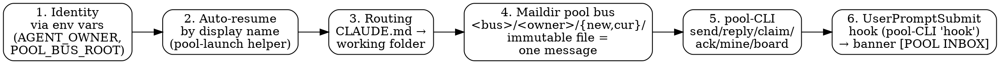
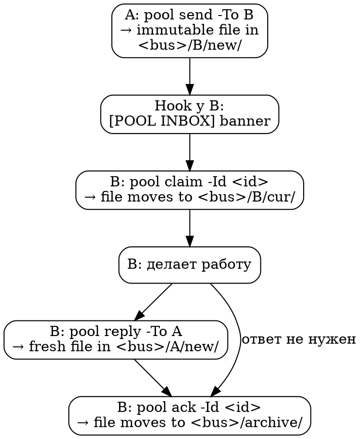

# Agent Pool Communication

Координационный слой, который позволяет нескольким сессиям Claude Code,
работающим в одной workspace-папке, обмениваться задачами без участия
человека-диспетчера. Это **базовый паттерн**, который применяется поверх
[Workspace Organization](workspace-organization.md) как опциональная
надстройка.

> Это описание паттерна, не инструкция под конкретный проект. Все
> идентификаторы (имена pool'ов, ролей, пути) заменены плейсхолдерами
> вида `<workspace-root>`, `<bus>`, `<pool-name>`, `<role>-<scope>`.
> Примеры из практики обезличены.

> ## ⚡ Координация — на maildir pool-шине (с этой ревизии)
>
> Координация между сессиями теперь идёт по файловой **pool-шине** (maildir):
> общая команда `pool` (одна общая копия pool-CLI на весь workspace) поверх
> каталога-шины `<bus>` (`POOL_BUS_ROOT`). Сообщение = **immutable-файл**;
> **адрес получателя = ПАПКА** `<bus>/<owner>/new/`; переходы (`new` → `cur`
> → `archive`) = атомарный rename. Это заменяет прежнюю связку Tasks API +
> `.inbox/`-mailbox + UserPromptSubmit-hook поверх Tasks-store.
>
> - **Координация:** `pool send` / `reply` / `inbox` / `claim` / `ack` /
>   `mine` / `board` / `watch`.
> - **Hook** на входящие — pool-CLI в режиме `hook` (читает
>   `<bus>/<owner>/new/`, эмитит `[POOL INBOX]`). Заменяет старый
>   `inject-inbox.ps1`.
> - **Вотчер** — встроенный режим `watch` той же pool-CLI (ledger
>   `<bus>/.ledger/seen-<owner>.txt`, lock `<bus>/.watch/lock-<owner>.txt`).
>   Заменяет отдельные `wait-for-task.ps1` / `Get-PendingTasks.ps1`.
> - **Новый пул** = скаффолдер (одна команда генерит весь bus-native
>   каркас из спеки, см. §10).
> - **Личные todo ОСТАЮТСЯ на Tasks API**
>   (`TaskCreate(metadata={kind:"personal"})`) — это не устарело. Дворник
>   личных todo тоже остаётся.
>
> Где ниже встречаются `~/.claude/tasks/<list>/`, `.inbox/`,
> `TaskCreate`/`TaskUpdate` как **канал координации** — это legacy
> Tasks-API-эпохи (оставлено для понимания старых пулов и истории решений).

---

## 1. Когда pool нужен, когда — нет

**Pool нужен**, когда любое из:

- 3+ активных Claude Code сессий, и пользователь устаёт быть диспетчером.
- Подпроекты делят интерфейс (API, формат данных), и его эволюция требует
  двусторонней синхронизации между сессиями.
- Один подпроект разрабатывается несколькими специализированными ролями
  параллельно (frontend / backend / qa / architect), и им нужно
  обмениваться задачами.
- Хочется автономной работы нескольких сессий в фоне или ночью.

**Pool избыточен**, когда:

- Один подпроект, один Tech Lead, никаких параллельных ролей.
- 1-2 подпроекта, пользователь сам в роли диспетчера справляется без
  перегрузки.
- Workspace стартовый и ещё не видно, какие подпроекты появятся.

Default для нового workspace — **plain** (без pool). Pool добавляется
бутстрапом, когда сигналы появились.

---

## 2. Шесть опор pool



1. **Идентичность** через env vars `AGENT_OWNER` (кто я) и `POOL_BUS_ROOT`
   (корень моей шины `<bus>`), выставляемые wrapper-батником на старте
   сессии. (`CLAUDE_CODE_TASK_LIST_ID` тоже выставляется — но уже только
   под **личные** todo, не координацию.)
2. **Auto-resume по display name** — двойной клик по wrapper'у возвращает
   агента в его же conversation, не открывает свежую.
3. **Routing**: `<workspace-root>/CLAUDE.md` (auto-loaded Claude Code'ом)
   маппит `AGENT_OWNER` → путь к рабочей папке.
4. **Maildir pool-шина** — каталог `<bus>` (`POOL_BUS_ROOT`). Сообщение =
   один immutable-файл; **адрес получателя = ПАПКА** `<bus>/<owner>/new/`;
   переходы (`new` → `cur` → `archive`) = атомарный rename. Все сессии
   одного workspace работают по одному `<bus>`.
5. **pool-CLI** — одна общая команда `pool` (один скрипт на весь
   workspace, в пулы не копируется): `send` / `reply` доставляют сообщение
   целиком, `claim` / `ack` ведут жизненный цикл, `mine` / `board`
   показывают состояние. См. §4.
6. **Hook UserPromptSubmit** = pool-CLI в режиме `hook` — читает
   `<bus>/<owner>/new/` и инжектит баннер `[POOL INBOX] <owner>: N
   pending` перед каждым промптом пользователя.

Без env vars (опора 1) и hook'а (опора 6) — pool вырождается в обычные
независимые сессии. Без routing CLAUDE.md (опора 3) — агенты не находят
свою рабочую папку. Шина (опора 4) + pool-CLI (опора 5) держат инвариант
доставки структурно: сообщение = файл, адрес = папка получателя, так что
«две половины» и мис-оунинг невозможны (см. §4).

---

## 3. Идентичность агента

### Owner ID

Формат: `<role>-<scope>` в kebab-case ASCII. Примеры (обезличенные):

- `tech-lead-foo` — Tech Lead подпроекта foo в **inter-project pool**.
- `frontend-bar`, `backend-bar`, `qa-bar` — три peer'а одного подпроекта
  bar в **intra-project pool** (см. §6).

Owner ID:

- стабильный (не меняется между сессиями),
- уникальный в рамках pool,
- читаемый человеком,
- = имя личного «ящика» в шине (`<bus>/<owner>/`), адрес для
  `pool send -To <owner>` и фильтр баннера hook'а. (В Tasks API остаётся
  как `owner` **личных** todo.)

### Display name

Заголовок сессии, под которым она видна в `/resume`-пикере и которым её
ищет auto-resume helper. PascalCase: `TechLead-Foo`, `Frontend-Bar`.

Выставляется флагом `claude --name <title>` при первом запуске или вручную
через `/rename` внутри сессии.

### Передача в сессию

```
cmd.exe   (set AGENT_OWNER=...; set POOL_BUS_ROOT=...; set CLAUDE_CODE_TASK_LIST_ID=...)
   ↓ child process
powershell -NoProfile -File <pool-launch helper>
   ↓ child process
claude.exe --resume <id>   (или --name <title>)
   ↓ child process (Claude Code spawns hook on UserPromptSubmit)
hook = pool-CLI 'hook'   (читает <bus>/<owner>/new/)
```

Все звенья наследуют env vars автоматически. Закрыл окно — переменные
умирают, никаких глобальных эффектов. Без `AGENT_OWNER`/`POOL_BUS_ROOT`
hook молчит, а `pool send/inbox/...` не знают, кто ты и где шина — агент
работает как обычный Claude, без pool.

Подробности wrapper'ов и hook'а — [Wrapper and Hook Scripts](wrapper-and-hook-scripts.md).

---

## 4. Pool-шина (maildir): формат и lifecycle координации

### Layout шины

Координация между сессиями идёт через **maildir-шину**: общая команда
`pool` (pool-CLI) поверх каталога `<bus>` (`POOL_BUS_ROOT`). Один общий
скрипт на весь workspace — в пулы НЕ копируется; все сессии одного
workspace работают по одному `<bus>`.

```
<bus>/   (= $POOL_BUS_ROOT)
├── <owner-A>/{tmp,new,cur}/   # личный ящик: new = входящие, cur = взятые в работу
├── <owner-B>/{tmp,new,cur}/
├── archive/                   # обработанные (после ack)
├── .ledger/seen-<owner>.txt   # ledger вотчера (что уже показано)
└── .watch/lock-<owner>.txt    # heartbeat-lock вотчера (singleton)
```

- **Сообщение = один immutable-файл.** id = `<unix-ms>-<hex>` (sortable,
  лексикографически = хронологически; НИКОГДА не переиспользуется).
  Записывается атомарно: сперва в `tmp/`, затем rename в
  `<получатель>/new/`.
- **Адрес получателя = ПАПКА** `<bus>/<owner>/new/`. Доставка — это и есть
  появление файла в его `new/`. Никакого отдельного «объекта-задачи с полем
  owner» — owner это каталог.
- **Переходы — атомарный rename:** `new/` → `cur/` (claim, взял в работу)
  → `archive/` (ack, завершил). Состояние видно всем сразу.

Вручную файлы в шину не пишут — только через `pool` (он гарантирует
атомарный `tmp`→`new` rename и UTF-8 без BOM для кириллицы). Тело — через
`-BodyFile`; крупные материалы (пачки, спеки) кладут файлом в репозиторий
подпроекта, в сообщении — ссылка на путь.

### Команды (résumé; детали — §4.1 и Wrapper and Hook Scripts)

| Действие | Команда |
|----------|---------|
| Поставить задачу / написать соседу | `pool send -To <peer> -From <self> -Subject "<тема>" -BodyFile <файл.md>` |
| Ответить / отчитаться | `pool reply -To <отправитель> -From <self> -Subject "Re: ..." -InReplyTo <id> -BodyFile <файл.md>` |
| Входящие (то, что в `new/`) | `pool inbox` (и баннер `[POOL INBOX]` каждый ход) |
| Своя «тарелка»: `cur/` + `new/` | `pool mine` |
| Взять в работу | `pool claim -Id <id>` |
| Завершить (после ack соседа) | `pool ack -Id <id>` |
| Доска пула / живая доска | `pool board` / `pool board -Show` |
| Вотчер (опц., фоном) | `pool watch` (см. §7.5) |

`Owner`/`BusRoot` в `inbox`/`claim`/`ack`/`mine` можно не передавать —
берутся из env (`AGENT_OWNER`/`POOL_BUS_ROOT`).

### 4.1 Lifecycle (на шине)

1. **Постановка:** A → `pool send -To B -From A -Subject "..." -BodyFile
   <файл.md>`. Файл атомарно появляется в `<bus>/B/new/`. Никакого второго
   шага — одна команда доставляет целиком.
2. **Принятие:** B видит задачу в `[POOL INBOX]` (hook, §7), читает её,
   `pool claim -Id <id>` — задача переезжает в `<bus>/B/cur/` (взято в
   работу).
3. **Ответ:** B → `pool reply -To A -From B -Subject "Re: ..." -InReplyTo
   <id> -BodyFile <файл.md>`. Свежее сообщение появляется в `<bus>/A/new/`
   → у A срабатывает и `[POOL INBOX]`, и вотчер.
4. **Завершение:** `pool ack -Id <id>` — задача из `cur/` уезжает в
   `<bus>/archive/`. Аудит — `archive/` + git-история репозитория.

### 4.2 Инвариант доставки — теперь его держит инструмент, а не дисциплина

В прежней (Tasks-API) модели сообщение соседу требовало **двух половин**:
payload-файл в `.inbox/` **И** объект-задача с правильным top-level
`owner`. Забыл вторую половину — получатель ничего не видел: его hook
фильтровал POOL INBOX строго по top-level `owner`, и payload в `.inbox/`
оставался невидимым. Эта грабля воспроизводилась в живых пулах многократно
(см. [Lessons Learned §1](lessons-learned.md)).

На шине этого больше нет — **переформулировано структурно**:

- **«Две половины» исчезли.** Сообщение = один файл, адрес = папка
  получателя `<bus>/<owner>/new/`; одна команда `send` доставляет целиком.
  Мис-оунинга не бывает — owner это каталог, а не поле, которое можно
  забыть выставить.
- **Отчёт = `reply`** (свежий id, кладётся в `new/` постановщика) → у него
  срабатывает и `[POOL INBOX]`, и вотчер. **Не закрывай чужую задачу как
  способ «отчитаться»** — этого механизма больше нет.
- **id уникальны и НИКОГДА не переиспользуются** — проблема переиспользования
  id старого Tasks-store (после архивации completed) ушла.
- **`claim` атомарен:** кто первый `claim` — того задача; остальные получат
  «уже взято».

### 4.3 После перезапуска / `/compact`

`inbox`/`[POOL INBOX]` показывает только **новое** (`new/`), НЕ твою работу
в процессе. После возобновления выполни **`pool mine`** — он покажет `cur/`
(взятое в работу) и `new/` (ожидающее). По задаче из `cur/` прочти её файл
(путь печатает `mine`), продолжи, в конце `ack`. Это твоя «тарелка» —
личный аналог Task UI.

---

## 5. Tasks API — ТОЛЬКО личные todo (не координация)

Координация ушла на шину; Tasks API остаётся под **личные todo** агента
(планирование внутри своей работы). Это НЕ устарело.

### Формат хранения

Tasks API хранит **каждую задачу отдельным JSON-файлом**:

```
~/.claude/tasks/<TASK_LIST_ID>/
├── 1.json              # одна задача = один файл
├── 2.json
├── .highwatermark      # счётчик последнего выданного ID
└── .lock               # файл-замок для concurrency
```

Никакого агрегатного `tasks.json` не существует (более старая публичная
документация местами ошибочно описывает агрегатный формат — это уже не
актуально). Поле в task-файле называется **`subject`** (не `title`);
внутреннее поле `id` совпадает с именем файла. Текущий `TaskCreate`
принимает ТОЛЬКО `subject`/`description`/`activeForm`/`metadata` и создаёт
`status=pending`; `owner` — не его параметр, адресуется отдельным
`TaskUpdate`.

### Конвенция личного todo

`metadata.kind="personal"` → такой todo не зашумляет `[POOL INBOX]`
соседей (координацию они получают из шины, не из Tasks API).

```
TaskCreate(
  subject="Разобрать модуль X",
  description="Личный шаг внутри моей текущей работы.",
  metadata={ "kind": "personal" }
)
→ TaskUpdate(<вернувшийся id>, owner="<self>")
```

`TaskList(owner='<self>')` вернёт их тебе — рабочий аналог `TodoWrite` для
личного планирования.

### Накопление `completed` и дворник (остаётся под личные todo)

`TaskUpdate(completed)` файл НЕ удаляет — completed копится. Claude Code
почти каждый ход инжектит системным напоминанием **весь** список `list_id`
(включая completed, без фильтра по `owner`) — раздувает контекст. Поэтому
остаётся **дворник** `archive-completed-tasks.ps1`: переносит
`status=completed` старше N часов из `~/.claude/tasks/<list>/` в соседний
`~/.claude/tasks/<list>-archive/` (move, обратимо; collision-safe).
Вызывается из `pool-launch` при старте сессии. Эталон —
[Wrapper and Hook Scripts §4.6](wrapper-and-hook-scripts.md).

> **Важно:** дворник теперь чистит **только личные todo** — координация на
> шине его не касается (у неё свой `archive/` внутри `<bus>`).

---

## 6. Топология: inter-project vs intra-project pool

Архитектура pool одинакова в обоих случаях. Разница — в том, что
считается зоной ответственности агента.

### A. Inter-project pool: 1 агент = 1 подпроект

- Каждый агент владеет своим подпроектом в `01_projects/<его-scope>/`.
- Координация — между подпроектами (согласование API-контракта и пр.).
- Границы записи **естественные** — каждый пишет в свою папку, чужие
  папки физически разделены.
- Owner ID: `<role>-<scope>` — `tech-lead-foo`, `tech-lead-bar`.

Подходит когда подпроекты — самостоятельные модули с разной судьбой, но
связаны интеграцией.

### B. Intra-project pool: N агентов = 1 подпроект, разные направления

- N агентов работают в **одной и той же** папке `01_projects/<подпроект>/`.
- Разделение по **направлению работы** или **зоне кода**.
- Границы записи **требуют явного дизайна** — все в одной папке,
  физического разделения нет.
- Owner ID: `<role>-<project-scope>` — `architect-foo`, `frontend-foo`,
  `backend-foo`, `qa-foo`. При двух peer'ах одной роли — `frontend2-foo`
  или `backend-search-foo` (если у второго специализация).

Подходит когда подпроект сложный, разные направления требуют параллельной
работы, но единое целое.

### Зоны ответственности в intra-project pool

Поскольку физических границ папок нет, зоны проговариваются явно.
Возможные подходы:

| Подход | Пример | Когда подходит |
|--------|--------|----------------|
| По поддиректориям кода | `frontend-foo` ↔ `02_src/frontend/`, `backend-foo` ↔ `02_src/backend/` | Код естественно разбит на модули |
| По типам файлов | `docs-foo` ↔ `00_docs/`, `code-foo` ↔ `02_src/` | Чёткое разделение «доменов» |
| По функциональным фазам | `architect-foo` — спецификации; `dev-foo` — код; `qa-foo` — тестирование | Параллельные этапы pipeline |
| Гибрид (большинство реальных случаев) | `architect-foo` ↔ `00_docs/architecture/`; `frontend-foo` ↔ `02_src/frontend/`; `backend-foo` ↔ `02_src/backend/`; `qa-foo` ↔ `00_docs/qa/` | Реальная практика |

Зоны фиксируются в `_agent_pool_setup-<scope>.md` каждого агента +
сводный `00_docs/architecture/agent-pool-zones.md` подпроекта.

### Особенности файловой организации intra-project pool

```
01_projects/<подпроект>/
├── CLAUDE.md                              # с блоком «Pool-режим (читать первым)»,
│                                          # перечисляет всех peer'ов
├── _agent_pool_setup-architect.md         # одна папка → N onboarding-файлов
├── _agent_pool_setup-frontend.md          # суффикс scope в имени
├── _agent_pool_setup-backend.md
├── _agent_pool_setup-qa.md
├── _handoff_<owner>.md                    # handoff между сессиями (см. §8)
├── claude-architect-<scope>.bat           # wrapper на каждого peer'а
├── claude-frontend-<scope>.bat
├── claude-backend-<scope>.bat
├── claude-qa-<scope>.bat
├── 00_docs/
│   ├── architecture/
│   │   └── agent-pool-zones.md            # разделение зон между peer'ами
│   └── qa/                                # зона записи qa-peer'а
├── 02_src/
│   ├── frontend/                          # зона frontend-peer'а
│   └── backend/                           # зона backend-peer'а
└── ...
```

### Риски intra-project pool

| Риск | Митигация |
|------|-----------|
| Git-конфликты: два peer'а редактируют один файл | Чёткие зоны в `agent-pool-zones.md`. Коммитить часто. Перед началом работы — проверять состояние. |
| Размывание границ: «слегка зайти в чужое» | Дисциплина: любая правка вне своей зоны — через `pool send -To <сосед>`, не прямая правка. |
| Worktree-изоляция недоступна отдельному peer'у | Один worktree — на весь подпроект. Если peer использует `superpowers:using-git-worktrees`, остальные ждут возврата. |
| Контекст-конкуренция в общей `02_src/` | Каждый peer при чтении видит и свою зону, и зоны соседей — плюс для интеграции, риск shallow understanding. В `_agent_pool_setup` явно перечислять «свой код = X, остальное — read-only context». |

Полный пошаговый recipe подъёма intra-project pool — [Intra-Project Pool
Recipe](intra-project-pool-recipe.md).

---

## 7. UserPromptSubmit hook (pool-CLI `hook`)

### Цель

Перед каждым промптом пользователя — вставить в контекст сессии баннер с
входящими (`new/`) сообщениями для текущего агента. Снимает с агента
дисциплинарную нагрузку «не забыть проверить inbox».

### Где живёт

Hook — **подкоманда общей pool-CLI** (`pool ... hook`), а не отдельный
скрипт. Отдельный hook-файл в пул **не копируется**. Регистрация — в
`<workspace-root>/.claude/settings.local.json` (gitignored), путь к
pool-CLI абсолютный. Полный пример регистрации и кода —
[Wrapper and Hook Scripts](wrapper-and-hook-scripts.md). Это заменяет
прежний `inject-inbox.ps1`.

### Поведение

1. Читает `$env:AGENT_OWNER` и `$env:POOL_BUS_ROOT`.
2. Если хотя бы одна не задана — выходит молча (`exit 0`). Pool неактивен,
   не шумим в контексте.
3. Читает `<bus>/<owner>/new/` (входящие, ещё не взятые в работу).
4. Эмитит баннер в stdout (id sortable — старшее сверху), который Claude
   Code оборачивает в блок `<user-prompt-submit-hook>` и инжектит в
   контекст модели.

Пример вывода:

```
[POOL INBOX] tech-lead-foo: 2 pending
 - <id> (from tech-lead-bar): <тема>
 - <id> (from qa-foo): <тема>
Take: pool claim -Id <id>
```

При 0 входящих — `[POOL INBOX] tech-lead-foo: clean (0 pending)` (это
диагностический сигнал, что pool активен и hook сработал). Чтобы заглушить
пустой баннер — `$env:POOL_INBOX_QUIET=1` (стоит в wrapper'ах по
умолчанию).

> Баннер показывает только `new/` (входящее, не взятое). То, что ты уже
> взял в работу (`cur/`), там НЕ показывается — после возобновления/`/compact`
> выполни `pool mine` (§4.3).

### Discovery: walk-up НЕ работает

Критично для intra-project pool. Claude Code ищет `.claude/settings.local.json`
с блоком `hooks` только в **cwd** и в **project-root**. Hooks из
ancestor-директорий **не подхватываются** автоматическим walk-up.

Из этого:

- **inter-project pool** (cwd wrapper'а = workspace root) —
  `settings.local.json` в `<workspace-root>/.claude/`, всё работает.
- **intra-project pool** — два варианта:
  - cwd wrapper'а = подпроект → `settings.local.json` обязательно в
    `<подпроект>/.claude/`;
  - cwd wrapper'а = workspace root (umbrella) → один
    `settings.local.json` покрывает все intra-project pool'ы семьи.
    **Предпочтительно**: одно место регистрации, минимум дублирования.

Признак, что hook не подхватился: env vars выставлены, но баннер не
появляется ни на одном промпте.

### Первое одобрение hook'а

`--dangerously-skip-permissions` **НЕ** обходит подтверждение нового
hook'а — это отдельный security gate. На первом запуске Claude Code
покажет prompt: «Allow command: powershell ... pool ... hook?». Без
одобрения hook не выполняется. На втором промпте — баннер появится сам.

### UTF-8 для кириллицы — уже внутри pool-CLI

На Windows hook крутится в Windows PowerShell 5.1, чей stdout по умолчанию
кодируется в OEM/ANSI — кириллический баннер пришёл бы к Claude Code в виде
mojibake. **pool-CLI сам выставляет UTF-8** на выводе и читает файлы шины
как UTF-8 — отдельно фиксить (как в старом кастомном hook'е) не нужно.
Полный рабочий пример — [Wrapper and Hook Scripts](wrapper-and-hook-scripts.md).

---

## 7.5. Опциональный push-watcher входящих задач

**Статус: опция, подключается по согласованию. НЕ обязательна для всех агентов.**

§7 даёт **pull**: получатель видит входящие, только когда сам отправляет промпт. Watcher — опциональное **push**-дополнение: будит простаивающую сессию при входящей задаче, не тратя контекст на ожидание (сон идёт в shell-процессе, не в модельном цикле). Pull-баннер остаётся всегда и страхует watcher (промах watcher'а покрывается баннером на следующем ручном промпте).

### Когда уместен / когда нет

Подключать (по согласованию): агент часто **простаивает в ожидании** задач от peer'ов (реактивная роль); важна низкая латентность; сессия живёт долго. Не нужен: агент непрерывно работает по своему беклогу; роль инициативная; короткие сессии.

### Именование: слово «watcher» зарезервировано за inbox-watcher'ом

Под «watcher» в пуле понимается **только** этот push-watcher на входящие задачи (`pool watch`) — **общее правило для всех агентов**, включая тех, кому он не подключён.

Любые **доменные** фоновые сторожа, которые агент заводит под свои нужды (ждать новый прогон, появление файла, внешнее событие), **нельзя** называть «watcher» в user-facing выводе. Иначе путаница: пользователь видит «висящий» процесс с надписью `WATCHER` и считает, что взведён нотификатор задач, хотя это другое. Реальный случай: агент запустил доменный сторож прогонов, печатавший `WATCHER armed`, — пользователь принял его за task-watcher и решил, что тот «не сработал», хотя inbox-watcher просто не был взведён.

Правило:
- слово «watcher» (в баннерах, логах, `print`, видимых пользователю именах процессов) — **только** за inbox-watcher'ом на задачи;
- доменные сторожа называть иначе: `RUN-WATCHER`, `batch-watcher`, `run-sentinel`, `*-poller` и т.п.;
- единственный признак «inbox-watcher жив» — **свежий** `<bus>/.watch/lock-<owner>.txt`; «висит фоновый процесс» ≠ «взведён inbox-watcher». При жалобе «watcher не сработал» — первым делом проверять свежесть лока, а не любой фоновый процесс.

### Механика

- `pool watch` — фоновый watcher на **одного** агента (Owner/BusRoot из env). Спит (`Start-Sleep` внутри shell-процесса), читает `<bus>/<owner>/new/`. На **новом** сообщении завершается с докладом → харнесс будит сессию. Это **встроенный режим** той же pool-CLI, что и `send`/`hook` — отдельных скриптов `wait-for-task.ps1` / `Get-PendingTasks.ps1` больше нет.
- **Read-only** по шине (сообщений не трогает). Состояние — внутри `<bus>` (gitignored): per-owner леджер `<bus>/.ledger/seen-<owner>.txt` + heartbeat-lock `<bus>/.watch/lock-<owner>.txt`.

Запуск — **из сессии агента**, фоновой задачей (`Bash run_in_background: true`):

```
powershell -NoProfile -ExecutionPolicy Bypass -File "<path-to-pool-cli>" watch
```

### Два инварианта корректности

1. **Идемпотентный перевзвод — через леджер.** Watcher метит id сообщения в приватном леджере (`<bus>/.ledger/seen-<owner>.txt`) **до выхода**; перевзведённый watcher это сообщение новым не считает.
2. **Один watcher на owner — heartbeat-lock.** Лок (`<bus>/.watch/lock-<owner>.txt`) обновляется каждый цикл; при свежем локе новый watcher сразу выходит. На выходе лок снимается, чтобы перевзвод не блокировался. **После `/compact` ранее взведённый watcher остаётся жить** (процесс переживает compact) — поэтому на возобновлении агент должен **сперва проверить свежесть `lock-<owner>.txt`** и взводить, только если живого нет (дубль и так сам выйдет, но проверка экономит пустой запуск). Класть эту проверку в файл, который агент перечитывает на возобновлении (per-owner handoff), а не только в setup.

### Структурный предел и дисциплина перевзвода

Пробуждение idle-сессии даёт **только** фоновая задача, запущенная инструментом агента, в момент её exit. Процесс, поднятый иначе (хук, внешний `.bat`, само-spawn), харнесс с сессией не свяжет ⇒ watcher не перевзведёт себя так, чтобы будить дальше; **перевзвод структурно обязан быть действием агента**.

Дисциплина: при пробуждении агент **первым делом** перевзводит watcher, потом берёт задачу. Усиление надёжности (по нарастающей): доклад watcher'а печатает перевзвод как **ШАГ 1** перед задачей (primacy + гейт); стоячее правило — в setup-файле агента; (опц.) **Stop-хук**, owner-gated, блокирует завершение хода, пока watcher не взведён (near-100%, но «липче», трогает общий hook-конфиг).

### Экспериментальный статус

Допущение «завершение фоновой задачи будит **простаивающую** сессию И переживает `/compact`» — подтверждать вживую на конкретном окружении до раскатки на pool. Если push не будит idle-сессию — механизм вырождается в pull (корректно, но без ускорения).

Команда и дисциплина перевзвода — [Wrapper and Hook Scripts §4.5](wrapper-and-hook-scripts.md).

---

## 8. Per-owner handoff (передача себе-следующему)

Pool-шина — координация **между** агентами. Handoff — координация агента
**с самим собой через время** (compact, перезапуск, новая сессия в той же
роли). Это другой канал.

### Два правила

1. **Файл.** Имя `_handoff_<AGENT_OWNER>.md`. Лежит в рабочей папке
   агента. Перезаписывается, не плодит `_v2`/`_new`/`_updated`.

2. **CLAUDE.md.** Pointer на handoff кладётся в самый специфичный
   CLAUDE.md, описывающий именно эту роль/подпроект. Не в
   workspace-уровневый общий. Pointer — одна строка, не содержание:

   ```markdown
   - Свой handoff: [`_handoff_<owner>.md`](_handoff_<owner>.md) (если есть)
   ```

### Что класть, что не класть

| Класть | Не класть |
|--------|-----------|
| Точно где остановился (файл, строка, следующий шаг) | Архитектурные решения — в `00_docs/architecture/` |
| Незавершённые мысли, открытые вопросы | Готовые знания о коде — в самом коде |
| Pointer на сообщение из `cur/`, по которому ещё работаешь | Дубликат тела сообщения — оно уже в шине / в репо |
| «Чего не повторять» — обратная сторона feedback'а | Личные напоминания общего характера — в memory |

Handoff делается **перед** ожидаемым compact'ом или закрытием сессии,
не «когда успею». Если контекст уже зашит — handoff в условиях нехватки
context window менее полезен.

---

## 9. Жизненный цикл задачи (сжатый flow)



«Две половины» / мис-оунинг / невидимые reply'и тут структурно невозможны
(см. §4.2).

---

## 10. Связанные документы

- [Workspace Organization](workspace-organization.md) — куда pool кладут
  в общую структуру workspace.
- [Wrapper and Hook Scripts](wrapper-and-hook-scripts.md) — полные
  рабочие примеры wrapper-батника, pool-launch helper'а, pool-CLI `hook`.
- [Intra-Project Pool Recipe](intra-project-pool-recipe.md) — пошаговое
  поднятие intra-project pool с нуля.
- [Lessons Learned](lessons-learned.md) — антипаттерны и грабли (включая
  историю two-halves/top-level `owner`).
- [Tech Lead Mode](tech-lead-mode.md) — рабочий режим Tech Lead'а, в
  котором каждый peer pool'а работает.
