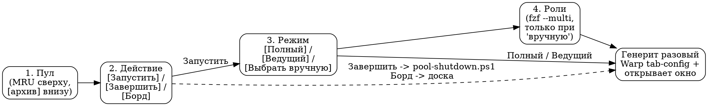

# Pool Launcher and Warp

Терминальный **пикер пулов** — единый **пульт** управления пулами: из одного
окна выбрать пул и **действие над ним** — запустить, завершить или открыть
борд. При запуске пикер сам разворачивает раскладку терминалов (на Windows —
через Warp). Заменяет и хождение по папкам за отдельными wrapper-батниками
(`claude-<owner>.bat`) каждого агента, и ручной вызов контроллера завершения.

> Это описание паттерна, не инструкция под конкретный проект. Все
> идентификаторы (имена пулов, ролей, пути) — плейсхолдеры вида
> `<workspace-root>`, `<pool-name>`, `<slug>`, `<owner>`, `<role>-<scope>`.
> Рабочий код — [../scripts/launch-pool.ps1](../scripts/launch-pool.ps1).

Смежные документы: как агенты общаются внутри пула —
[Pool Communication](pool-communication.md); wrapper'ы и hook'и, которые
запускает пикер, — [Wrapper and Hook Scripts](wrapper-and-hook-scripts.md);
живая доска и вотчер, которые поднимаются вместе с пулом, —
[Board and Watcher](board-and-watcher.md); механику действия «Завершить» —
[Pool Shutdown & Context Refresh](pool-shutdown-and-context-refresh.md).

---

## 1. Зачем нужен пикер

Когда пулов в workspace становится больше двух-трёх, запуск «руками»
деградирует: нужно помнить, где лежит wrapper каждого агента, открывать их
по одному, самому раскладывать окна. Пикер снимает это:

- **один вход** на весь workspace (движок [../scripts/launch-pool.ps1](../scripts/launch-pool.ps1),
  обёрнутый батником-ярлыком), из него виден каждый пул;
- **декларативный состав** — пул описан одним файлом-манифестом
  (`pool.manifest.json`), пикер его читает, а не хардкодит;
- **выбор объёма запуска** — весь пул, только ведущий или произвольное
  подмножество ролей;
- **авто-раскладка** окон, без ручного тетриса панелей.

Пикер **портативен**: движок — один `.ps1`, `fzf.exe` лежит рядом (один
бинарь, без установки в систему), состояние — в локальной `.state\`. Тот же
каталог целиком переносится на другую машину / удалённый сервер.

> Граница ответственности: пикер **находит** пулы и **зовёт** — wrapper'ы (при
> запуске) либо контроллер завершения `pool-shutdown.ps1` (при «Завершить»). Сам
> он НЕ взводит вотчер, НЕ несёт стартовый промпт и НЕ держит механику фаз
> завершения — это делают wrapper (см. §9 и [Board and
> Watcher](board-and-watcher.md)) и контроллер (см. [Pool Shutdown & Context
> Refresh](pool-shutdown-and-context-refresh.md)).

---

## 2. Манифест пула — `pool.manifest.json`

Каждый пул декларирует себя одним файлом. Схема (`pool-manifest/v1`):

```json
{
  "schema": "pool-manifest/v1",
  "slug":   "<slug>",
  "title":  "<человекочитаемое имя пула>",
  "project": "<строка-подпись проекта>",
  "root":   "<workspace-root>\\<pool-dir>",
  "color":  "cyan",
  "lead":   "<owner-ведущего>",
  "roles": [
    { "owner": "<owner-1>", "title": "<Роль 1>", "bat": "claude-<owner-1>.bat", "lead": true },
    { "owner": "<owner-2>", "title": "<Роль 2>", "bat": "claude-<owner-2>.bat" }
  ]
}
```

| Поле | Смысл |
|------|-------|
| `slug` | Технический id пула. Из него собирается имя разового Warp-конфига (`poollaunch-<slug>.toml`) и ключ MRU. |
| `title` / `project` | Что пикер показывает в списке. |
| `root` | Папка, где **лежат `.bat`** ролей. Она же — рабочая директория (`directory`) панели; команда роли = `cmd /c "<root>\<bat>"`. |
| `color` | Цвет **таба** Warp (у панелей своего цвета нет — см. §8). |
| `lead` | `owner` ведущей роли — идёт первой в раскладке и в режиме `[Ведущий]`. |
| `roles[]` | `{owner, title, bat, lead?}` на каждого агента. |
| `archive?` | `true` → пул уезжает в отдельную группу внизу списка с пометкой `[архив]`. |
| `layout?` | Явное дерево панелей. Обычно НЕ пишется — пикер строит раскладку сам (§7). |

**`root` и место манифеста — это разные вещи.** `root` указывает, где
батники; сам `pool.manifest.json` может лежать в другом месте (например, у
подпроекта, а `root` — в общей папке скриптов монорепо). Дискаверинг
находит манифест по дереву, а панели раскрывает из `root`.

> Скаффолдер нового пула генерит `pool.manifest.json` автоматически (без
> `layout` — раскладка авто), так что новый пул виден в пикере сразу, без
> отдельного «rollout». См. [Pool Scaffolding](pool-scaffolding.md).

---

## 3. `control.json` — одиночные управляющие сессии

Не всё, что хочется запускать из пикера, — проектный пул. Управляющие /
мета-сессии (оркестратор workspace, server-wide DevOps и т.п.) — это
**одиночные сессии**, а не пулы, и часто живут в **чужих зонах записи**,
куда правильнее не класть свой `pool.manifest.json`.

Для них есть централизованный файл `control.json` рядом с движком пикера —
**массив manifest-подобных объектов** той же формы, что и `pool.manifest.json`
(обычно по одной роли на запись). Пикер подмешивает их в общий список
наравне с найденными манифестами.

Обезличенный пример — [../scripts/control.json.example](../scripts/control.json.example):

```json
[
  { "schema": "pool-manifest/v1", "slug": "<control-slug>",
    "title": "<Control Session>", "project": "<назначение>",
    "root": "<workspace-root>", "color": "white", "lead": "<owner>",
    "roles": [ { "owner": "<owner>", "title": "<Роль>", "bat": "<owner>.bat", "lead": true } ] }
]
```

> `control.json` — рабочий файл (не `.example`). Веди его **сплайсингом
> через PowerShell** (`WriteAllText`, UTF-8 без BOM), а не Edit-инструментом:
> формат — как у `ConvertTo-Json` PS 5.1, и правка «обычным» редактором без
> BOM бьёт кириллицу в уже записанных полях. См.
> [Windows PowerShell Pitfalls](windows-powershell-pitfalls.md).

---

## 4. Дискаверинг манифестов

Пикер обходит рабочие корни (по умолчанию — корень workspace)
**рекурсивно, до глубины 3**, собирая все `pool.manifest.json`. Тяжёлые и
служебные папки в обход не берутся: `node_modules`, `.git`, `.bus`,
`.warp`, `.state`, `.inbox`.

Это значит: чтобы пул появился в пикере, достаточно **положить манифест** в
дерево workspace (или добавить запись в `control.json`). Никакой
регистрации, ни списка пулов в коде — источник истины распределён по самим
пулам.

---

## 5. Поток пикера

Выбор идёт уровнями, между которыми `Esc` возвращает на шаг назад
(… → действие → пулы → выход из пикера). UI — `fzf` в ASCII-режиме
(`--no-unicode`), инкрементальный fuzzy-поиск.



1. **Пул.** Список отсортирован по недавности запуска (MRU, §6); архивные
   пулы — отдельной группой внизу с пометкой `[архив]`. У каждого показано
   время последнего запуска.
2. **Действие над пулом** — пикер стал **пультом**, а не только лаунчером:
   - `[Запустить]` — поднять сессии пула (ветка «режим → роли» ниже);
   - `[Завершить]` — корректно **снять** весь пул или выбранные роли: пикер в
     отдельном окне зовёт контроллер завершения
     [`pool-shutdown.ps1`](../scripts/pool-shutdown.ps1) (`-Full -CloseWindow`;
     при подмножестве — `-Only <roles>`), с шагом подтверждения объёма
     («ВЕСЬ пул» / «роли: …»). Механику фаз (handoff → гашение → compact) держит
     сам контроллер — см. [Pool Shutdown & Context
     Refresh](pool-shutdown-and-context-refresh.md);
   - `[Борд]` — открыть/поднять живую [доску пула](board-and-watcher.md).
3. **Режим** (ветка `[Запустить]`):
   - `[Полный]` — все роли пула;
   - `[Ведущий]` — только `lead`;
   - `[Выбрать вручную]` — мультивыбор ролей (`fzf --multi`, `TAB` —
     отметить, `Enter` — запуск).
4. **Роли** (только для «вручную») — отметить нужные.

В ветке `[Запустить]` после выбора пикер **генерит разовый Warp tab-config и
открывает окно** (§7), обновляет MRU и возвращается к списку пулов (можно
запустить следующий). Пикер — **синглтон**: второй запуск не плодит окно, а
выводит уже открытое на передний план (named-mutex + `.state\owner.pid`).

---

## 6. Разовый Warp tab-config

На Windows целевая раскладка — **Warp Tab Config** (TOML: один таб со
сплит-панелями). Пикер под каждый запуск пишет **разовый** файл
`poollaunch-<slug>.toml` в `$env:APPDATA\warp\Warp\data\tab_configs\` и
открывает его deep-link'ом:

```
warp://tab_config/poollaunch-<slug>?new_window=true
```

(`slug` в URL = имя файла; `?new_window=true` = своё окно, иначе таб в
активном.)

**Ключевая деталь — команды стоят только в ВЫБРАННЫХ панелях.** Панель
выбранной роли получает `commands = ['cmd /c "<root>\<bat>"']` (запускает
агента). Панель **невыбранной** роли остаётся пустым шеллом, но с
**ASCII-подсказкой-однострочником**: как её доднять (прямой `.bat` или Warp
Workflow, §8). То есть даже незапущенные панели самодокументируемы.

Фокус ставится на панель `lead` (если он в наборе) либо на первую выбранную
роль.

> **Почему разовый.** Каждый запуск перезаписывает `poollaunch-<slug>.toml`
> под текущий выбор ролей. Старые `poollaunch-*.toml` в `tab_configs\`
> инертны — сами по себе они не открываются (см. §8, ловушка Restoration).

Механику Warp-конфига (плоский массив `[[panes]]`, split-узлы, deep-link)
подробнее разбирает [Wrapper and Hook Scripts](wrapper-and-hook-scripts.md);
здесь — только то, что делает **пикер**.

---

## 7. Авто-раскладка

Если в манифесте нет явного `layout`, пикер строит сетку из ролей сам:

- **лид — первым**;
- роли пакуются в **колонки по ≤2 панели** (иначе панели слишком низкие);
- колонки растут **вправо** (горизонтальный split верхнего уровня).

Так манифест сводится к простому списку ролей — рисовать дерево панелей
руками не нужно. `layout` в манифесте оставлен как ручной override для
редких случаев, когда авто-сетка не устраивает.

Пример: 5 ролей без `layout` → лид + ещё 4 → три колонки (первая с лидом и
одной ролью, две по паре).

---

## 8. Доднятие роли в пустой панели

Внешне впрыснуть команду в **уже открытую** панель Warp нельзя. Поэтому
роль, не выбранную на старте, доднимают одним из двух способов (оба
раскатываются вместе с пулом):

1. **Warp Workflows** — нативные сниппеты Warp. На каждую роль в `root`
   лежит `\.warp\workflows\<owner>.yaml`. В пустой панели: `Ctrl-Shift-R` →
   имя роли (fuzzy) → запускает её `.bat`. Работает, даже если в одной
   `.warp\workflows` смешаны роли нескольких пулов.
2. **Подсказка в панели** — тот самый ASCII-однострочник, который пикер
   печатает в каждую невыбранную панель (§6): показывает и прямой путь к
   `.bat`, и как искать Workflow.

> Warp «Command History» (недавние команды) из конфига **не засеять** — это
> история реально выполненных команд, а не предзагрузка. Отсюда и два
> способа выше.

> **Цвет per-agent недостижим (закрыто).** В Warp цвет — атрибут таба, у
> отдельных панелей своего цвета нет; в Claude Code поле `color` красит
> только субагентов, к главной сессии неприменимо. Различать роли
> приходится по заголовку панели/сессии, не по цвету.

---

## 9. Ловушка: лишнее окно Warp при холодном старте

Пикер открывает **ровно один** `warp://tab_config/poollaunch-<slug>?new_window=true`
и чужие пулы не зовёт. Если при запуске всё же всплыло **второе** окно с
пулом, который «закрывал последним», — это **Warp Session Restoration**
(включён по умолчанию): когда Warp был полностью закрыт, холодный старт
через deep-link сперва **восстанавливает прошлую сессию** (последнее
закрытое окно), а потом открывает запрошенный таб = два окна. Если Warp уже
запущен — эффекта нет.

Для этого workflow restore бесполезен: он **не перезапускает процессы** —
восстановленные панели это мёртвые шеллы со старым выводом. Лечится в
настройках Warp:

```
Settings → Features → «Restore windows, tabs, and panes on startup» → off
```

(Тумблер есть только в приложении — файл настроек Warp зашифрован, снаружи
не правится.) Оставшиеся `poollaunch-*.toml` в `tab_configs\` на restore не
влияют — он тянет снимок из своей базы, а не из этих файлов.

---

## 10. Взведение вотчера — это wrapper, а НЕ пикер

Важное разграничение. Пикер лишь зовёт `.bat`; всё, что должно случиться
**внутри** сессии на старте (стартовый промпт, взвод вотчера), живёт в
**wrapper'е**, а не в пикере:

- wrapper читает стартовый промпт из UTF-8-файла и отдаёт его `claude`
  позиционным аргументом (в промпте — «взведи вотчер»);
- watcherless-роли (DevOps / серверные) намеренно стартуют без вотчера.

Поэтому один и тот же пул можно поднять и пикером, и двойным кликом по
wrapper'у — поведение внутри сессии одинаково. Детали wrapper'а — в
[Wrapper and Hook Scripts](wrapper-and-hook-scripts.md); вотчер, борд и
watcherless-политика — в [Board and Watcher](board-and-watcher.md).

---

## 11. Связанные документы

- [Pool Communication](pool-communication.md) — шина, по которой общаются
  запущенные агенты.
- [Board and Watcher](board-and-watcher.md) — живая доска пула и
  push-вотчер, поднимаемые вместе с пулом.
- [Wrapper and Hook Scripts](wrapper-and-hook-scripts.md) — устройство
  wrapper'ов, hook'ов и Warp tab-config, которые дёргает пикер.
- [Pool Scaffolding](pool-scaffolding.md) — как рождается новый пул сразу с
  манифестом и Warp Workflows.
- [Pool Shutdown & Context Refresh](pool-shutdown-and-context-refresh.md) —
  контроллер завершения, который зовёт действие «Завершить».
- Код: [../scripts/launch-pool.ps1](../scripts/launch-pool.ps1),
  [../scripts/control.json.example](../scripts/control.json.example),
  [../scripts/pool-shutdown.ps1](../scripts/pool-shutdown.ps1).
