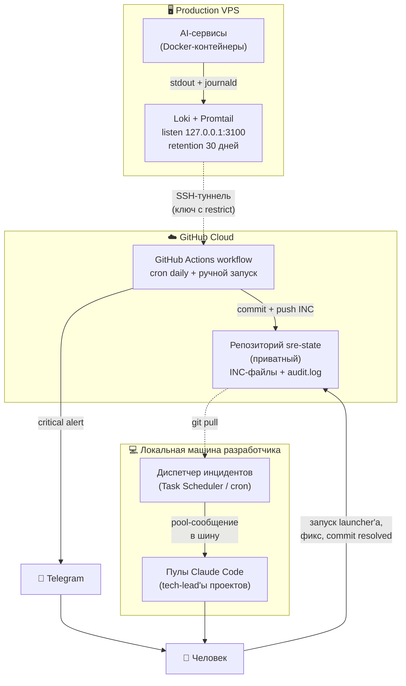
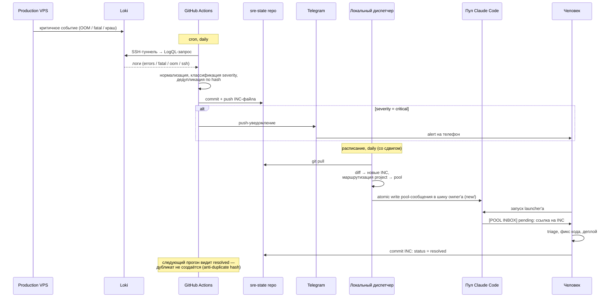
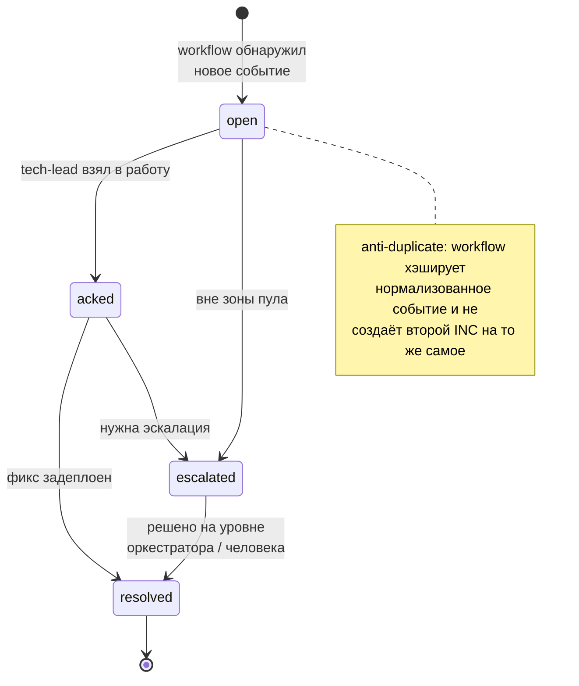

# Self-Healing контур для AI-сервисов

Описание архитектуры и процесса замкнутого контура самовосстановления для
production-сервисов, которые разрабатываются и сопровождаются ИИ-агентами
(Claude Code и совместимые).

> Это **описание паттерна**, не инструкция под конкретный сервер. Все
> идентификаторы (IP, ключи, имена репозиториев, токены) заменены
> плейсхолдерами вида `<VPS_IP>`, `<your-org>/sre-state`. Реальные секреты
> хранятся в GitHub Actions Secrets и в локальном хранилище ключей — в этом
> документе их нет и быть не должно.

---

## 1. Задача

AI-сервисы в проде падают так же, как обычные: OOM, необработанные исключения,
упавшие контейнеры, деградация зависимостей. Особенность — **чинит их тоже
ИИ-агент**, а не дежурный инженер. Значит, нужен контур, который:

- автоматически **обнаруживает** проблему по логам;
- **уведомляет** человека при критичных событиях (точка контроля);
- **диспетчеризует** задачу починки в нужный пул Claude Code — тому
  tech-lead'у, чья зона ответственности затронута;
- сводит **ручное участие человека** к «нажать кнопку и проверить результат».

Контур не заменяет процесс безопасного деплоя и не делает авто-ремедиацию в
проде без явно одобренного рецепта (см. [§9](#9-границы-чего-контур-не-делает)).

---

## 2. Три плоскости

Контур намеренно разнесён по трём средам — у каждой своя роль и свой режим
доступа.

| Плоскость | Что живёт | Режим работы |
|-----------|-----------|--------------|
| **Production VPS** | AI-сервисы в Docker + лёгкий лог-стек | Всегда онлайн, наружу закрыт |
| **GitHub Cloud** | Мониторинг по расписанию + хранилище инцидентов | Просыпается по cron |
| **Локальная машина** | Диспетчер + пулы Claude Code | Работает, когда разработчик за компьютером |

Ключевая идея: **облако наблюдает, локальная машина чинит, человек — точка
контроля между ними**. VPS не имеет доступа наружу и ничего не инициирует — его
только «опрашивают».

---

## 3. Архитектурная схема



---

## 4. Компоненты

### 4.1. Лог-стек на VPS

**Loki + Promtail** (без Grafana). Promtail собирает `stdout` Docker-контейнеров
и `journald`, Loki хранит и отдаёт по HTTP API (LogQL).

- Слушает только `127.0.0.1:3100` — наружу порт не открыт.
- Retention ~30 дней.
- Очень лёгкий: суммарно ~140 MB RAM, помещается на VPS с 2 vCPU / 4 GB.
- **Grafana не ставится сознательно**: UI человеку здесь не нужен, потребитель
  логов — ИИ-агент, который ходит в HTTP API.

### 4.2. Cloud monitoring — GitHub Actions workflow

Workflow в приватном репозитории `<your-org>/sre-state`, один файл на
сервис: `.github/workflows/log-monitor-<service>.yml`.

Запуск: `cron` (например, раз в сутки) + `workflow_dispatch` (ручной).
Шаги:

1. Зафиксировать `WORKFLOW_START_TS` (для фильтра уведомлений).
2. `checkout` репозитория `sre-state`.
3. Поднять SSH-agent (`webfactory/ssh-agent`).
4. Доверить host key VPS (из секрета `VPS_HOST_KEY`).
5. Открыть SSH-туннель `localhost:3100 → VPS:3100`.
6. Сделать LogQL-запросы, сложить результат во временные файлы по группам
   (`errors`, `fatal`, `oom`, `ssh`).
7. Запустить **Claude Code Action** (`anthropics/claude-code-action`): он
   нормализует события, классифицирует severity, проверяет на дубликаты,
   пишет INC-файлы, делает `commit` + `push`.
8. Отправить Telegram-уведомление на каждый **новый critical** INC.
9. Закрыть туннель.

**Доступ к VPS** даётся отдельным SSH-ключом, который на сервере прописан с
жёстким ограничением — только проброс порта Loki, никакого shell:

```
restrict,port-forwarding,permitopen="localhost:3100" ssh-ed25519 AAAA...
```

Даже если ключ утечёт — это доступ к чтению логов через туннель, не к серверу.

**Секреты workflow** (GitHub Actions Secrets, в репозитории — только имена):

| Секрет | Назначение |
|--------|------------|
| `VPS_SSH_KEY` | приватный ключ для SSH-туннеля (restrict'нутый) |
| `VPS_HOST`, `VPS_PORT`, `VPS_USER` | координаты сервера |
| `VPS_HOST_KEY` | host key сервера (защита от MITM) |
| `CLAUDE_CODE_OAUTH_TOKEN` | OAuth-токен Claude (`claude setup-token`), не API-billing |
| `TELEGRAM_BOT_TOKEN`, `TELEGRAM_CHAT_ID` | канал push-уведомлений |

### 4.3. Репозиторий инцидентов `sre-state`

Один приватный репозиторий — единое состояние контура для всех сервисов и
рабочих пространств. Инцидентов немного, отдельный репозиторий на каждый
проект был бы избыточен.

```
sre-state/
├── README.md                       # формат, конвенции
├── <workspace>/
│   ├── <service-a>/<YYYY-MM>/INC-<service-a>-<YYYY-MM>-NNN-<slug>.md
│   ├── <service-b>/...
│   └── _platform/...                # инциденты общей инфраструктуры
├── _routines/audit.log              # TSV-журнал прогонов workflow
├── _post-mortems/
├── _recipes/                        # рецепты авто-ремедиации (поздний этап)
└── .github/workflows/               # YAML мониторинга, по файлу на сервис
```

**INC-файл** — Markdown с frontmatter. Ключевые поля:

```yaml
project:           <workspace>/<service>
service:           <имя контейнера/сервиса>
severity:          critical | high | medium
status:            open | acked | resolved | escalated
discovered_at:     <timestamp>
acked_at:          <timestamp | null>
resolved_at:       <timestamp | null>
normalized_hash:   <хэш нормализованного события — основа дедупликации>
retry_count:       <int>
related_incidents: [<id>, ...]
```

`normalized_hash` — то, что превращает контур в **замкнутый**: workflow на
следующем прогоне видит уже существующий INC с тем же хэшем и не плодит
дубликаты; а когда человек поставил `status: resolved` — повторное событие
заведёт новый INC только если оно действительно повторилось.

### 4.4. Локальный диспетчер

Скрипт + запись в планировщике ОС (Windows Task Scheduler / cron). Запускается
по расписанию, со сдвигом после облачного workflow (например, workflow в
09:00 UTC → диспетчер в 12:30 локального времени). Опция «догонять пропущенные
запуски» — на случай выключенного компьютера.

Что делает:

1. `git pull` постоянного локального клона `sre-state`.
2. `diff` между последним обработанным `HEAD` и текущим → список новых INC.
3. Для каждого нового INC парсит frontmatter:
   - если `status ∉ {open, acked}` — пропустить;
   - по полю `project` ищет в таблице маршрутизации соответствующий
     **пул / owner / launcher**;
   - idempotency-проверка: если сообщение по этому INC уже есть в шине
     пула (`<bus>/<owner>/`) — пропустить;
   - **атомарно** кладёт инцидент в шину пула как pool-сообщение в
     `<bus>/<owner>/new/` (получатель = папка owner'а) — так его увидит
     `pool hook` и покажет в `[POOL INBOX]`. Пишется через `pool send`
     (атомарный `tmp`→`new` rename и UTF-8 гарантирует pool-CLI), не прямой
     правкой каталога.

   > Примечание: доставка инцидента показана в целевой модели — через
   > pool-шину. Если ваш диспетчер исторически писал в отдельный task-store
   > (`~/.claude/tasks/<pool>/`), мигрируйте канал доставки на
   > `<bus>/<owner>/new/`, чтобы `pool hook` увидел инцидент.
4. Сохраняет текущий `HEAD` в state-файл (idempotency между запусками).
5. Печатает консольное summary:
   - если нового нет → «контур работает штатно», окно закрывается само;
   - если есть → список пулов с количеством задач и **конкретный путь к
     launcher'у**, который надо запустить.

**Таблица маршрутизации** (`project → pool`) — единственное, что нужно
дополнять при появлении нового сервиса:

| project | pool | owner по умолчанию | launcher |
|---------|------|--------------------|----------|
| `<workspace>/<service-a>` | `<service-a>-pool` | `tech-lead-<service-a>` | `.../claude-tl-<service-a>.bat` |
| `<workspace>/_platform` | `ops-pool` | `sre` / `devops` | `.../launch-ops.bat` |
| *(fallback)* | `ops-pool` | `sre` / `devops` | `.../launch-ops.bat` |

### 4.5. Push-уведомления

Telegram-бот (`@BotFather`), токен и chat_id — в секретах workflow. Workflow
шлёт сообщение **только на `severity: critical`** и только на INC, открытые
именно в этом прогоне. `high` / `medium` человек увидит при ближайшем запуске
диспетчера — без шума на телефоне.

### 4.6. Пулы Claude Code

Пул — это связка из нескольких ролей-агентов (tech-lead, devops и т.п.),
работающих над одним проектом и обменивающихся задачами через файловую
**pool-шину** (maildir-каталог `<bus>`, `POOL_BUS_ROOT`; см. [Pool
Communication](pool-communication.md)). Диспетчер кладёт в шину
pool-сообщение со ссылкой на INC — в `<bus>/<owner>/new/` нужного агента;
при следующем запуске пула его hook (`pool hook`, читает `new/`) показывает
баннер `[POOL INBOX] <owner>: N pending`, и агент берёт инцидент в работу.

---

## 5. Полный поток данных



---

## 6. Жизненный цикл инцидента



Переходы статуса делает либо ИИ-агент в пуле (взял в работу → `acked`,
починил → `resolved`), либо человек (эскалация, ручной фикс). Состояние всегда
живёт в одном месте — в INC-файле в репозитории `sre-state`.

---

## 7. Классификация severity

Классификацию делает Claude Code Action внутри workflow по правилам, заданным
в его промпте. Базовый набор:

| Условие | severity | Действие |
|---------|----------|----------|
| Есть совпадения в группах `oom` или `fatal` | **critical** | INC + Telegram сразу |
| Группа `errors`: ≥ 100 событий / 24 ч | **high** | INC, человек увидит при диспетчеризации |
| Группа `errors`: 30–99 событий / 24 ч | **medium** | INC, без push-уведомления |
| Группа `errors`: < 30 событий | — | пропустить |
| `ssh` (перебор паролей из интернета) | — | пропустить, строка в `audit.log` |

Пороги — стартовые; по мере накопления статистики и перехода сервисов на
структурированные (JSON-lines) логи их понижают и уточняют.

---

## 8. Ключевые архитектурные решения

| Решение | Почему так |
|---------|------------|
| Loki + Promtail **без Grafana** | потребитель логов — ИИ-агент через HTTP API, человеку UI не нужен |
| **GitHub Actions**, а не Anthropic Routines | у Routines нет нативного хранилища секретов; Actions Secrets решают это «из коробки» |
| Auth через `CLAUDE_CODE_OAUTH_TOKEN` (Pro/Max) | не тратит API-billing |
| **Один общий** приватный репозиторий `sre-state` | инцидентов мало, репозиторий на проект — избыточно |
| Диспетчер через **планировщик ОС**, а не хук Claude Code | контур не должен зависеть от того, открыл ли человек Claude Code; и не должен срабатывать на каждое открытие |
| SSH-ключ workflow с `restrict,permitopen` | утечка ключа = доступ только к чтению логов через туннель, не к shell |
| Telegram только на `critical` | остальное человек видит при диспетчеризации — нет шума на телефоне |
| `normalized_hash` в frontmatter INC | делает контур замкнутым: нет дубликатов, повторное событие после `resolved` отслеживается корректно |
| VPS наружу не инициирует ничего | его только «опрашивают» по расписанию — меньше поверхность атаки |

---

## 9. Границы: чего контур не делает

Без явного согласования с человеком контур **не**:

- ставит глобальные хуки Claude Code;
- делает авто-ремедиацию в проде без заранее одобренного рецепта на конкретный
  класс инцидента;
- подменяет стандарт безопасного деплоя (pre-deploy snapshot, healthcheck,
  rollback — отдельный процесс, контур его не трогает);
- заводит push-каналы помимо Telegram;
- меняет маршрутизацию production-трафика (это зона DevOps и tech-lead'а
  проекта).

Человек остаётся **точкой контроля**: контур доводит инцидент до его внимания и
готовит задачу, но решение «чинить / эскалировать / отложить» — за человеком.

---

## 10. Что требуется от человека

**В обычном режиме:** ничего регулярного. Появилось окно диспетчера — запустить
нужный launcher и разобрать pending-задачи. Пришёл Telegram-alert — то же
самое, но раньше.

**При добавлении нового сервиса:**

1. Добавить строку в таблицу маршрутизации диспетчера.
2. Создать `.github/workflows/log-monitor-<service>.yml` в `sre-state` по
   шаблону существующего.
3. Поставить tech-lead'у проекта задачу на структурированные логи +
   расширенный `/health`-эндпоинт.

**При ротации ключей:** обновить соответствующий секрет в GitHub Actions (и
`authorized_keys` на VPS — для SSH-ключа).

**После ручного фикса инцидента:** в INC-файле поменять `status` на `resolved`,
заполнить `acked_at` / `resolved_at`, добавить секцию с резолюцией, `commit` +
`push`.

---

## 11. Этапы внедрения

Контур разворачивается инкрементально — каждый этап самостоятелен и полезен:

1. **Лог-стек** на VPS (Loki + Promtail).
2. **Workflow мониторинга** для первого сервиса (GitHub Actions + cron).
3. **Репозиторий `sre-state`** + конвенция INC-файлов + `audit.log`.
4. **Telegram-push** для `critical`.
5. **Локальный диспетчер** + запись в планировщике ОС.

Дальше — по мере накопления статистики реальных инцидентов:

6. Структурированные логи (JSON-lines) + расширенные healthcheck'и в сервисах,
   понижение порогов severity.
7. Авто-ремедиация для известных классов инцидентов (`_recipes/`).
8. Регулярные rollback-учения, post-mortem'ы.

Тиражирование на новый сервис или новое рабочее пространство — это пункты
1–3 из [§10](#10-что-требуется-от-человека): строка в маршрутизации + workflow
по шаблону + задача tech-lead'у.

---

*Документ описывает паттерн, проверенный в реальной эксплуатации связки
ИИ-агентов Claude Code. Конкретные значения (адреса, ключи, токены, имена
сервисов) у каждого свои и в этот документ не входят.*
