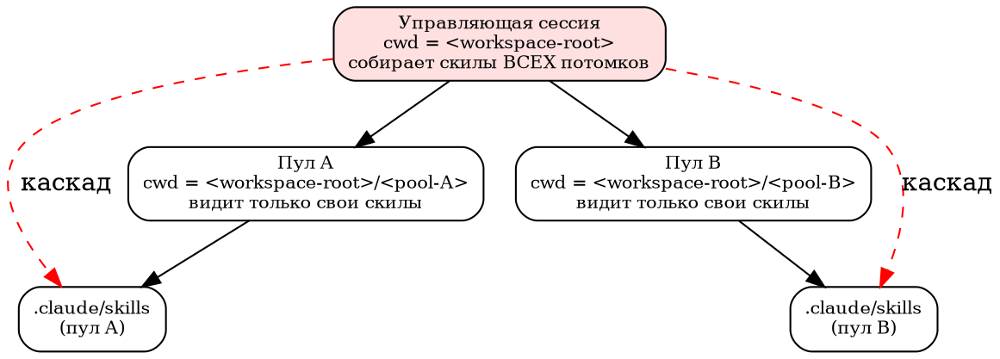

# Система скилов Claude Code

Как устроены **скилы** (agent skills) в Claude Code и как мы их применяем
для организации workspace: механика загрузки, жёсткий бюджет листинга,
паттерн «тонкий стаб + вынос канона», асимметрия дискаверинга по cwd и
правила авторинга.

Читать инженеру, который поднимает такое пространство с нуля и хочет
понять, **почему скилов должно быть мало**, где им жить и как не сломать
триггеринг у соседних сессий.

> Это описание паттерна, не инструкция под конкретный проект. Пути и имена
> заменены плейсхолдерами (`<workspace-root>`, `<organizer-home>`,
> `<pool-name>`, `<role>-<scope>`). Числа-настройки (`0.01`, `1536`, …) —
> реальные значения Claude Code на момент написания; сверяйтесь с
> `/doctor` и `/context`, если версия харнесса разошлась.

---

## 1. Что такое скил и как он грузится

Скил — это папка `<...>/.claude/skills/<name>/` с файлом **`SKILL.md`**.
Файл состоит из двух частей:

```markdown
---
name: coordinating-on-the-pool-bus      # лейбл; ИМЯ КОМАНДЫ = имя папки скила
description: Используй когда ставишь задачу соседу; видишь [POOL INBOX]; ...
---

# Тело скила
Императивные инструкции: что делать, когда скил сработал. В контекст
попадает ТОЛЬКО после срабатывания.
```

- **`name`** — человекочитаемый лейбл. Имя, которым скил вызывается
  (`/<name>`), берётся из имени **директории**, а не из этого поля.
- **`description`** — единственный механизм авто-триггеринга. Модель решает,
  применять ли скил, читая это описание.
- **Тело** — процедура. Пока скил не сработал, тело **в контекст не
  грузится** вовсе.

### Что грузится всегда, а что — по триггеру

Ключевая экономика скилов держится на этом разделении:

| Часть | Когда в контексте | Стоимость |
|-------|-------------------|-----------|
| `description` | **ВСЕГДА**, весь сеанс — сидит в кэшируемом системном префиксе | постоянная (занимает окно контекста), но дешёвая по токенам за счёт prompt-cache |
| Тело `SKILL.md` | **только после срабатывания** скила | нулевая до триггера; после — висит всю сессию |

Отсюда два практических следствия:

1. **`description` — это ТОЛЬКО триггеры** (когда применять: симптомы,
   ключевые слова, имена инструментов), **не workflow**. Если описание
   пересказывает пошаговый процесс, модель начинает исполнять описание
   вместо того, чтобы прочитать тело — а тело для того и вынесено, чтобы
   не занимать контекст постоянно. Формула описания: *что делает
   (высокоуровнево) + конкретные триггеры/симптомы*, без шагов.

2. **Тело — рекуррентная стоимость.** Каждая строка тела висит в контексте
   до конца сессии после первого срабатывания. Поэтому тело держат
   императивным и коротким (ориентир — <500 строк; после `/compact` от
   тела остаётся первые ~5000 токенов). Тяжёлое выносят в `references/`
   рядом со скилом (ноль токенов, пока файл не прочитан явно).

> **Точная механика префикса** (частый источник путаницы): `description`
> **не** переинжектится каждый ход. Они лежат в кэшируемом системном
> префиксе и (а) **постоянно** занимают окно контекста весь сеанс
> (конкурируют с данными и историей); (б) повторное чтение дёшево
> (prompt-cache); (в) при переборе бюджета — усекаются или выбрасываются.
> Это «стоячая занятость + жёсткий потолок», а не «повторная инъекция».

---

## 2. Бюджет листинга — почему скилов должно быть МАЛО

Сумма всех `description` (это и есть «листинг скилов») ограничена сверху.

| Параметр | Значение | Что делает |
|----------|----------|------------|
| `skillListingBudgetFraction` | `0.01` (~1% контекста) | потолок на весь листинг описаний |
| `skillListingMaxDescChars` | `1536` | потолок на одно описание (комбинированное `description` + `when_to_use`) |

При переборе любого потолка Claude Code **усекает или выбрасывает
описания** — и делает это **молча**. Внешне это выглядит так: скил на
месте, файл валиден, но авто-триггеринг по нему **перестаёт срабатывать**,
потому что модель видит обрезанное (или не видит вовсе) его описание.

**Диагностика перегруза:**

- `/doctor` — покажет, сколько описаний укорочено/выброшено.
- `/context` — покажет размер блока Skills в контексте.

**Правила против тихого отказа триггеринга:**

- **Держать описания короткими** (ориентир авторинга ≤1024 символа, задолго
  до жёсткого потолка 1536). Ключевой триггер — **в начало** описания:
  хвост режется первым.
- **Мало крупных, хорошо очерченных скилов лучше, чем много мелких.** Цель
  — не «всё в скилы», а «сумма описаний ≪ той always-on прозы, которую
  скилы заменяют».
- **Агрессивно сливать родственное** в один скил (например, все
  Windows-гочи — в один; весь troubleshooting шины — в один), вместо
  россыпи плоских скилов-листьев.
- При реальной нехватке потолок поднимается (`skillListingBudgetFraction`
  → `0.02`), но это лечение симптома — сначала проредить листинг.

---

## 3. Тонкие стабы + вынос канона (single-source)

Общий скил (например, «ловушки Windows» или «координация на шине») нужен
многим пулам. Наивный ход — положить копию `SKILL.md` в каждый
`<pool-name>/.claude/skills/` — возвращает ровно ту дупликацию, которую мы
убирали в остальном (одна общая `pool.ps1`, один канон координации). N
копий по пулам разъезжаются: правишь знание — обходишь N файлов.

**Паттерн:** скил-стаб хранит только **поведение** (триггеры), а
**контент** живёт в одном каноническом файле в общей зоне `.references/`,
которая лежит **вне всех рабочих cwd**.

### Как выглядит стаб

```markdown
---
name: avoiding-windows-pitfalls
description: Используй когда правишь .ps1/.bat/файлы с кириллицей, видишь
  mojibake, делаешь полный аудит репозитория, либо получаешь EPERM
  (uv_spawn) при запуске дочерних процессов.
---

# Ловушки среды Windows

Выполни и следуй выводу:

    & "<workspace-root>/.references/ref.ps1" windows
```

Тело стаба — одна команда: «запусти инжектор канона по теме `windows`».

### Как работает инжектор

`ref.ps1 <topic>` (см. [`../scripts/ref.ps1`](../scripts/ref.ps1)) держит
маппинг «тема → канонический файл в `.references/`», читает нужный файл и
**печатает его в контекст агента**, обёрнутый рамкой:

```
=== INSTRUCTION (windows): apply the guidance below to your current task ===
<...канонический документ...>
=== END OF INSTRUCTION (windows) ===
```

Что это даёт разом:

- **Single-source.** Знание живёт в одном файле `.references/<topic>.md`.
  Обновляешь его — стабы во всех пулах трогать не надо, они лишь ссылаются
  по теме.
- **Инжект в точке применения.** Канон попадает в контекст **в момент,
  когда он нужен** (recency), а не висит always-on. И он **переживает
  `/compact`**: скил перечитывается и снова печатает канон.
- **Вне досягаемости рутины.** `.references/` — папка-сиблинг в
  `<workspace-root>`, **вне cwd** любого пула и управляющей сессии, и
  **без своего `.claude/skills/`** (в дискаверинге не участвует). Никто не
  ходит туда в рутинной работе — пишет только хранитель канона.

### Дисциплина инжектора (иначе кириллица и BOM)

- Вывод инжектора — **UTF-8** (`[Console]::OutputEncoding = UTF8`), иначе
  кириллица придёт к модели как mojibake.
- Литералы в самом `.ps1`-инжекторе — **ASCII by design**: это обходит
  BOM-ловушку `.ps1` (правка файла без BOM бьёт кириллицу). Кириллица —
  только в контент-файлах `.references/*.md` (UTF-8 markdown), не в коде
  скрипта.
- Явно указывать **намерение**: «Run `ref.ps1 <topic>`» = исполнить и
  получить вывод, а не «прочитай скрипт».

Для мелкого локального знания плоский файл `references/` рядом со скилом
проще инжектора — скрипт берут под **общее/широкое** знание, шарящееся
между пулами.

---

## 4. Каскад дискаверинга и как cwd раздувает листинг

Claude Code ищет скилы **вниз от cwd**: собственный `.claude/skills/` и
любые вложенные `.claude/skills/` в поддереве. Это порождает **асимметрию**,
критичную при нескольких пулах в одном workspace:



- **Пул-агент защищён.** Его cwd = его монорепо; вверх (к родителю) и вбок
  (к соседним пулам) он **не смотрит**. В его листинг попадают только его
  скилы — бюджет под контролем.
- **Управляющая сессия — нет.** Если cwd управляющей/организаторской сессии
  = **корень** workspace, она собирает в свой листинг `description` **всех**
  дочерних пулов (как scoped-скилы). По мере роста числа пулов её листинг
  разбухает → упирается в бюджет 1% → **её собственные** описания начинают
  усекаться (см. §2). Это бьёт по организатору, не по пулам.

**Структурный фикс — перенести cwd управляющей сессии в под-папку.**
Организатор стартует не из корня, а из своей папки-**сиблинга** пулов
(`<workspace-root>/<organizer-home>/`, дот-папка рядом с монорепо, **не их
предок**). Тогда каскад вниз захватывает только `<organizer-home>/.claude/skills/`
— соседние пулы больше не потомки, их описания в листинг не въезжают.
Основной дом скилов организатора при этом — `<organizer-home>/.claude/skills/`.

Цена и нюансы переноса cwd:

- **ProjectKey сдвигается.** cwd определяет идентичность проекта Claude Code
  (ключ выводится из пути cwd, поэтому перенос корень→`<organizer-home>`
  меняет его). При переносе разово мигрируют memory и историю (`.jsonl`) в
  новый ключ, иначе теряется преемственность сессий — известная гоча смены
  ProjectKey.
- **Доступ к файлам cwd НЕ ограничивает.** Работа по всему
  `<workspace-root>` сохраняется через абсолютные пути (+ `--dangerously-skip-permissions`).
  Оговорка: `additionalDirectories` даёт доступ, но скилы из тех папок **не
  грузит** — грузит только `--add-dir`; для чистого листинга это и нужно.
- **Новая top-level папка скилов видна только после РЕСТАРТА** Claude Code
  (частая причина «скил не виден»). Правки текста существующего `SKILL.md`
  подхватываются в текущей сессии; новая папка — нет.

Слабая альтернатива без переноса cwd — `skillOverrides = off` по именам
чужих скилов в `settings.local.json` организатора (список ведётся руками).
Перенос cwd решает это структурно, без списка.

---

## 5. Мета-скил: когда контент становится скилом (авторинг)

Скилы авторятся по отдельному скилу-мете (`authoring-skills`), который
поверх методологии `superpowers:writing-skills` накладывает наши рельсы.
Два вопроса решаются до написания.

### Критерий: это вообще скил?

Дом контента определяется тем, **КОГДА** он нужен:

| Контент | Дом | Не скил, потому что |
|---------|-----|---------------------|
| Идентичность / роутинг (нужно всегда) | `CLAUDE.md`, тонко | тело скила НЕ always-on — грузится по триггеру |
| Факт для припоминания (known-unknown) | memory / файл | справочник: агент знает, когда искать — скил-триггер не нужен |
| Механически проверяемое ограничение | хук / валидатор | проза не гарантирует; проверяет код |
| **Процедура «как сделать X» по триггеру** | **СКИЛ** | — |

**Скил оправдан, если выполнено одно из:**

- модель **без него ошибается** — либо не знает гочу среды (env-специфику),
  либо **знает, но нарушает под нагрузкой** задачи (реальный случай: агент
  знает про утечку `.env`, но всё равно выполняет команду, печатающую
  секрет, когда увлечён отладкой);
- он **снимает always-on вес** — выносит из CLAUDE.md/setup разросшуюся
  повторяющуюся *процедуру* (не факт).

Чистый справочник, который модель и так знает или который нужен лишь по
явной просьбе, — **не скил**: он зря занимает бюджет листинга. Такое → в
memory или reference-файл.

> **Скилы ОБЁРТЫВАЮТ существующие стандарты/runbooks, не создают третий
> источник истины.** Скил-стаб → канон в `.references/` → он же
> `standards/*`. Один факт — одно место.

### Iron Law: нет скила без падающего теста сперва

Скил пишется под **зафиксированный провал**, а не «на всякий случай»:

1. **RED** — свежий субагент **без** скила получает задачу-ловушку. Дословно
   фиксируются его рационализации/промахи. Если baseline **не** провалился —
   скил, возможно, не нужен (модель и так справляется).
2. **GREEN** — минимальный скил ровно под эти провалы. Тот же тест на
   свежем субагенте проходит.
3. **REFACTOR** — закрыть лазейки: субагент нашёл обход — правило
   ужесточается (без оговорок «…unless it matters» — они заново открывают
   торг).

**Match the Form to the Failure:** нарушение правила под давлением → запрет
+ таблица рационализаций; неверная форма вывода → позитивный
рецепт/контракт; пропуск обязательного → структурный слот в шаблоне.
Тест-петля на Windows: **Agent A пишет / свежий Agent B применяет** — через
`Agent`-tool.

---

## 6. Уровни размещения

Где физически лежит `SKILL.md` — определяет, **кто его видит** (через
каскад §4), а значит, чей бюджет листинга он занимает.

| Уровень | Дом | Кто видит |
|---------|-----|-----------|
| **Базовый** (кросс-роль, любой агент) | стаб в каждом `<pool-name>/.claude/skills/` + канон в `.references/` | все агенты своего пула; знание одно (single-source) |
| **Организатор** (управляющая сессия) | `<organizer-home>/.claude/skills/` | сессии организатора (cwd = `<organizer-home>`); пулам невидимы — не потомки |
| **Пул / домен** | `<pool-name>/.claude/skills/` (в git) | агенты этого монорепо; едет с проектом |
| **Роль** (tech-lead, qa, …) | тот же `<pool-name>/.claude/skills/`, кладётся только нужным ролям | агенты пула; типизируется по роли скаффолдером |

**`personal ~/.claude/skills/` — избегать.** Его `description` грузится в
листинг **каждой** сессии — всех пулов, всех агентов, — засоряя чужой
бюджет и триггеринг. Personal-global резервируют под истинно-универсальное
(на практике — почти ничего). Приоритет при коллизии имён: enterprise >
personal > project; плагинные — в неймспейсе `plugin:<name>`.

Базовые скилы (Windows-гочи, работа с секретами) новому пулу кладёт
**скаффолдер** сразу — не в общий global, а стабами в репозиторий пула. Так
общее знание доезжает до каждого агента, оставаясь одним каноном в
`.references/`.

---

## Связанные документы

- [Workspace Organization](workspace-organization.md) — где скилы и
  `.references/` стоят в общей структуре workspace; перенос cwd организатора.
- [Agent Pool Communication](pool-communication.md) — координация на шине,
  которую оборачивают скилы `coordinating-on-the-pool-bus` /
  `operating-in-a-pool`.
- [Pool Scaffolding](pool-scaffolding.md) — как скаффолдер раздаёт стартовый
  набор скилов новому пулу.
- [Wrapper and Hook Scripts](wrapper-and-hook-scripts.md) — env vars и
  запуск сессий, от которых зависит cwd и дискаверинг.
- Скрипт-инжектор канона: [`../scripts/ref.ps1`](../scripts/ref.ps1).
